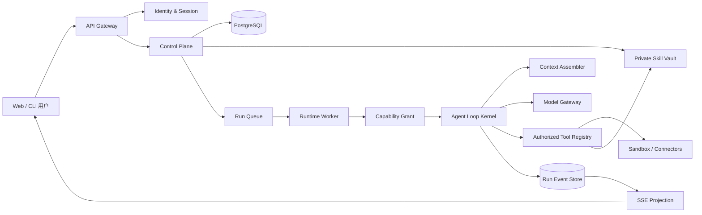
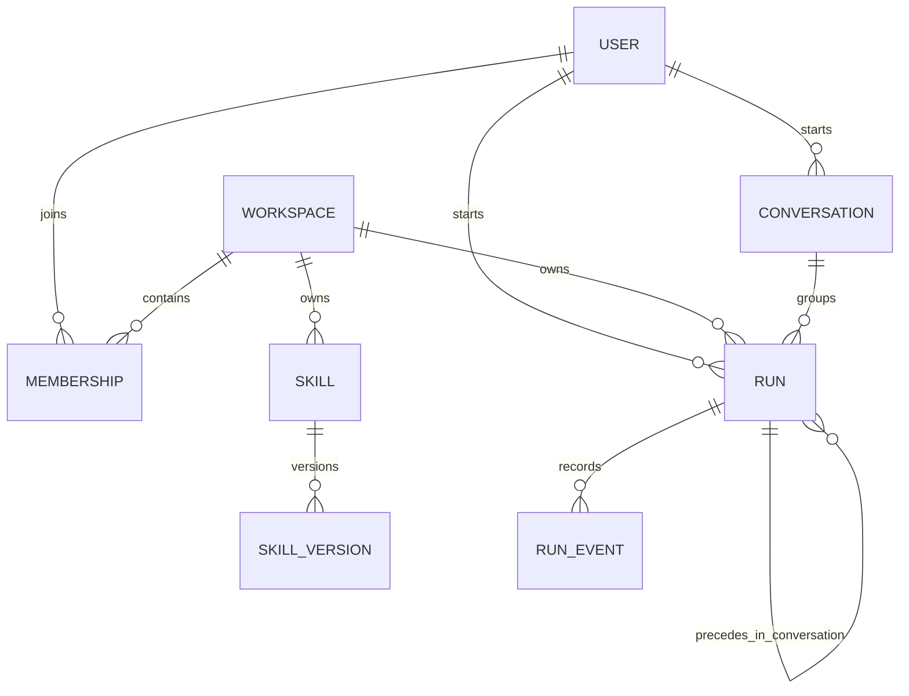
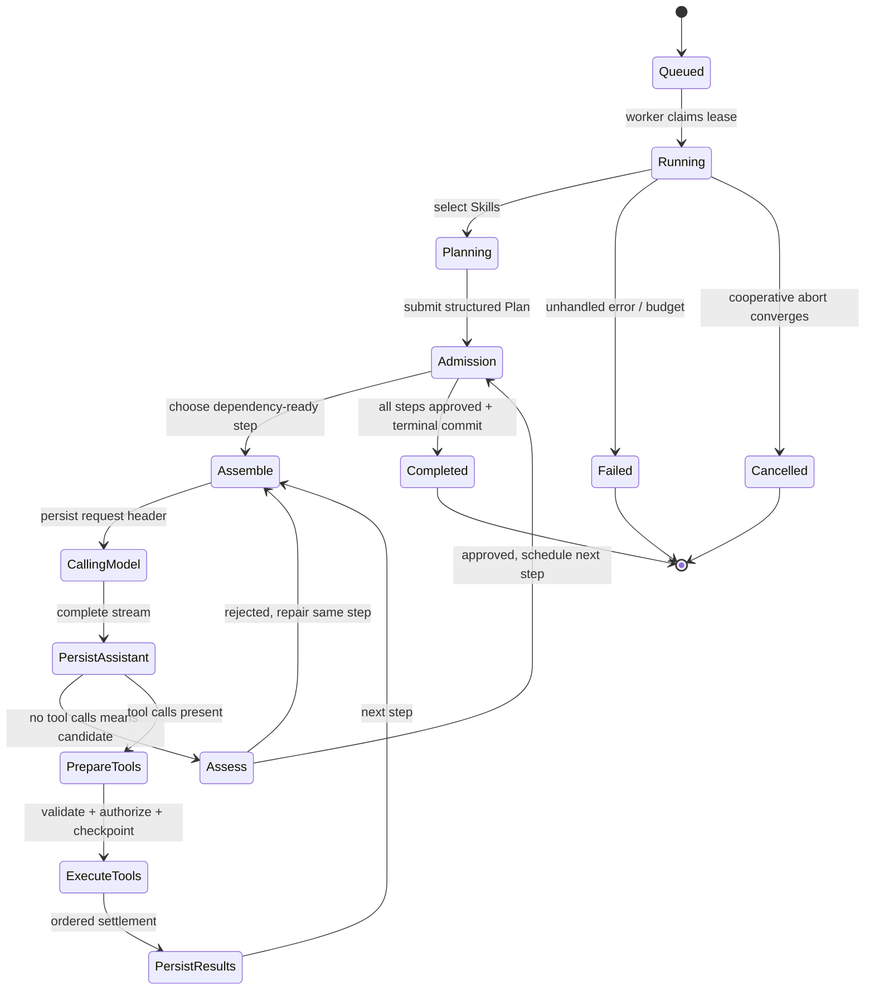
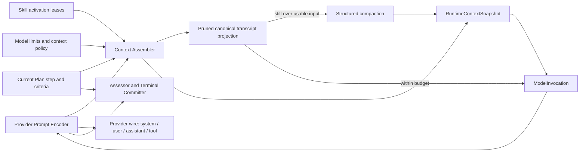
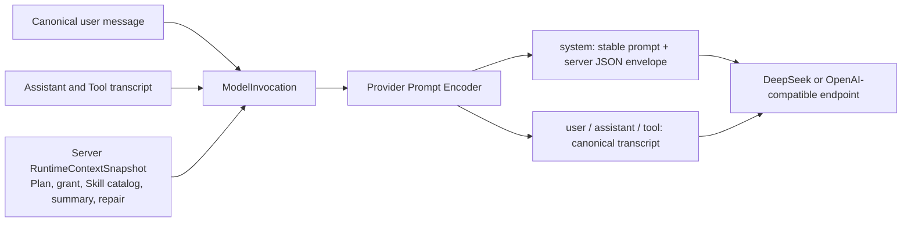

# AgentLoop 智能体框架设计方案

版本：v0.4
日期：2026-08-19
状态：单 Agent + Plan-first + Package Skill 本地参考实现

## 1. 设计结论

本项目采用“多租户控制面 + Plan-first 运行面”的双平面架构：

- 控制面拥有用户登录、Workspace、成员角色、私有 Skill、模型 Provider 配置和审计。
- 运行面拥有不可变能力凭证、Agent Loop、Tool Registry、上下文组装、模型适配器、事件持久化和预算。
- LLM 只负责生成内容、选择已暴露工具、填写参数、读取结果并继续推理。它不能决定自己能访问哪个 Skill、是否绕过预算，或宣告一个失败的运行已完成。
- 顶层 `skills/` 是服务端正式发现源；每个结构有效的第三方 Package 在使用前原样物化到当前用户隔离的只读 Store。来源锁仅在存在且匹配时提供可选溯源信息；显式 `.disabled.json` 可隔离不能进入 Runtime 的用户侧目录。Skill 目录 API 与 Skill 正文分离；Planner 和已绑定 Step 初始只接收授权目录，必须通过 `load_skill` 激活当前 Run 的精确版本。`load_skill` 不能成为越权入口。
- 运行是单 Agent 的：服务端使用固定 persona 驱动每个 Run，没有 Agent 定义、Skill 绑定或委派概念。Run 的 Skills 由用户身份决定（私有 + 官方发现），执行工具集只由 `allowDangerousTools` 门控；模型不能要求、交换或提升工具。
- 会话是单 Agent 的会话：后续轮次通过 `conversationId` 继承同一会话的上下文，`parent_run_id` 只表达同一会话内的轮次先后，不构成委派谱系。
- 批次是 `Batch → BatchItem → Run → Plan`，并发和失败策略只调度独立 Run，不能绕过单 Run 的规划、Skill 和终态提交链。

真实契约是：从登录身份进入 Worker 后，所有模型调用、Skill 加载和 Tool 执行都必须服从同一份持久、可审计、不可由模型修改的授权事实；Run 只有在 Plan 全部步骤的成功标准与 Skill Compliance 都通过后，才能由 Terminal Committer 提交完成。

## 2. 范围与非目标

### 2.1 v1 必须具备

- 邮箱密码登录；后续可接企业 OIDC。
- 用户或 Workspace 私有 Skill，版本化、按需加载、默认不公开正文。
- 支持 Function Calling 的通用 Agent Loop。
- 单 Agent 多轮工具调用，以及多个 Run 的并行执行。
- 会话、消息、工具调用/结果、用量和状态的持久化。
- SSE 实时事件、取消、失败恢复、可观测性和审计。

### 2.2 明确不是 v1 的目标

- 不在 Loop 中硬编码业务流程或某个 Skill 名称。
- 不承诺任意外部副作用 exactly-once；通过幂等键、预执行检查点和明确的“不安全重放”状态管理不确定窗口。
- 不允许用户通过 Run API 提交任意模型 Base URL，避免 SSRF 和密钥外送。模型端点由服务端 Provider Registry 管理。
- 不让多个 Worker 同时驱动同一个 Run；并发发生在不同 Run 或同一步的安全工具之间。

## 3. 总体架构



边界说明：

1. API 根据会话确定 `actorUserId` 和 `workspaceId`，客户端传入的同名字段一律不可信。
2. 控制面根据数据库事实生成 Run Spec；Worker 接收的是签名或数据库读取的 Run ID，不接收“请遵守某权限”的提示词。
3. Worker 在每一步模型请求前物化工具 Schema。被拒绝的工具完全不进入模型上下文。
4. Tool 执行前再次校验能力凭证和资源所有权，防止 Run 创建后绑定发生变化或陈旧调用命中新实现。
5. Run Event Store 是状态恢复与 UI 投影的权威来源；模型回复文本不是完成状态。

## 4. 领域模型与所有权

目标生产数据模型：



主要实体：

| 实体 | 权威字段 | 关键约束 |
|---|---|---|
| User | `id, email, status` | email 规范化后唯一 |
| AuthSession | `tokenHash, expiresAt, userId` | 数据库不保存明文 Token |
| Workspace | `id, owner, policy` | 生产租户边界 |
| Conversation | `ownerUserId, title` | 单 Agent 会话容器，轮次按 `created_at` 排序 |
| Skill | `workspaceId, visibility, activeVersion` | 默认 private；不可跨 Workspace 引用 |
| SkillVersion | `contentHash, objectKey, createdBy` | 内容不可变；新修改产生新版本 |
| Run | `actor, conversationId, status` | 一个时刻只有一个驱动 Lease；`parent_run_id` 仅表示会话内先后轮次 |
| RunEvent | `runId, seq, type, payload` | 每 Run 单调序号、追加写 |

当前原型先实现 `owner_user_id` 隔离；这已经能保证用户之间的私有 Skill、Conversation 和 Run 不互见。迁移到 Workspace 时，所有权谓词从 `owner_user_id = actor` 升级为 `workspace_id + membership + visibility`，运行时能力凭证结构不变。

## 5. 身份与会话

### 5.1 当前实现

- 密码使用 Node `scrypt` 加随机盐派生，数据库不保存明文。
- 登录 Token 使用 256 bit 随机值，数据库只保存 SHA-256 摘要。
- 所有资源查询都把认证得到的 `userId` 放入 SQL 谓词；外国资源返回 `404`，不暴露 ID 是否存在。
- `/v1/skills` 目录不返回正文。

### 5.2 生产设计

- 浏览器使用 `HttpOnly; Secure; SameSite=Lax` 会话 Cookie；写请求采用 Origin/CSRF 防护。
- 企业部署增加 OIDC Authorization Code + PKCE，账号与企业主体显式绑定。
- Session 支持设备列表、强制吊销、短期 Access + 滚动续期。
- 管理操作、Skill 正文读取、Run 启动与会话轮次写入不可篡改审计流。
- 登录限速、密码泄漏字典检查、MFA 和异常登录告警属于 Identity 服务，不放入 Loop。

## 6. 私有 Skill

### 6.1 内联 Skill 与原样 Package

控制台目录只展示摘要，不公开正文：

```text
internal-research: 内部研究流程
contract-review: 合同复核规范
```

内联 Skill 由租户直接定义名称、描述和完整指令正文。Package Skill 面向现成第三方目录：框架不包装、不改写 `SKILL.md`，两种来源进入同一条渐进式装载路径，不存在框架侧的规划提示、Tool 要求、完成标准或绑定模式副本。当前实现的完整路径为：

```mermaid
sequenceDiagram
  participant C as Control Plane
  participant D as Skill Directory
  participant I as Package Inspector
  participant V as Read-only Skill Store
  participant L as Planner / Agent Loop
  participant M as Model
  participant T as Computer Tools
  participant E as Event Store

  C->>D: scan each skills/*/SKILL.md
  D->>I: package bytes + optional verified source metadata
  I->>I: reject symlink/traversal/limits; hash every admitted file
  I->>V: per-user byte-for-byte copy; recompute hash; chmod read-only
  L->>V: verify before planning/run step/assessment/terminal
  L->>E: skill.package.verified
  L->>M: available_skills catalog only
  M->>L: load_skill(name)
  L->>M: exact SKILL.md + package root/hash/optional source ToolResult
  M->>L: submit structured Plan
  L->>M: Step starts with load_skill-only activation gate
  M->>L: load_skill(name); receive same exact version
  M->>T: invoke scripts/resources from admitted package root
  T->>V: read allowed; writes denied
  M->>L: completion candidate with Tool evidence
```

必须同时通过三道门：

1. 调用者（Skill 的所有者或有权读取该 Skill 的用户）是技能加载的唯一来源；跨用户 Skill ID 不可读取正文或绑定。
2. 手工 Package 安装目录必须位于服务端白名单，并要求 HTTPS 来源、完整提交 SHA 和预期全包 hash 与实测一致；正式 `skills/` 目录只要求每个 Package 结构和完整性有效，可选来源锁不会影响准入。
3. Run 创建时 Skill 身份进入不可变 Grant；Planner、Step、Assessment、Terminal Commit 使用同一版本，Package 每个阶段复核完整性，Computer Executor 禁止写入托管目录。

任何一层都不能用用户任务 Prompt 重写 Skill。Planner 与执行 Step 都通过 `load_skill({name})` 取得已经授权的精确正文和 Package 元数据；未激活完当前 Step 的绑定 Skill 前，其他执行 Tool 不可见。`load_skill` 不能发现未授权 Skill、切换版本或扩张 Tool 能力。

### 6.2 生产存储

- 元数据存 PostgreSQL，正文/资源存 S3 兼容对象存储。
- 每个 SkillVersion 内容寻址并保存 `sha256`；Package hash 覆盖规范化相对路径、文件长度和逐文件原始字节，Run 记录实际核验的来源提交与摘要。
- Skill 领域流程只存在于版本化原文中；外部副作用的幂等、重放和 exact-once 边界由 Plan、Tool Grant、`effect_pending` 与具体 Tool 协议负责，不借 Skill 包装字段表达。
- 使用 Workspace 数据密钥做信封加密；KMS 主密钥轮换不重写所有对象。
- Skill 包导入时禁止路径逃逸、符号链接、非常规文件和超额内容；网络下载/解压属于服务端供应链入口，不能由 Run 提交任意 URL 触发。
- Skill 指令视为可信的租户代码，但不能因此获得未授予的 Tool；工具能力仍由 Runtime 决定。

## 7. Agent Loop

核心状态机：



一步的规范顺序：

1. 从持久 Session 投影消息，并领取当前 inbox。
2. 组装稳定系统前缀、`available_skills` 目录、最近上下文和当前工具 Schema；初始上下文不含 Skill 正文。
3. 当前 Step 存在绑定 Skill 时先进入激活门：只物化 `load_skill`，把精确原文作为 ToolResult 持久化；全部激活后才物化该 Step 的其他 Tool。
4. 记录模型请求头（provider/model、上下文 epoch、预算、可见工具摘要）。
5. 调用模型并流式发布增量；完整 AssistantMessage 持久化后才分类工具调用。
6. 对每个 ToolCall 做 Schema 校验、资源鉴权、权限策略和 replay 分类。
7. 在外部副作用前记录 `effect_pending`。
8. 并行安全调用使用有界池；独占调用形成屏障。执行可以乱序完成，结果必须按模型调用顺序提交。
9. 为每个 ToolCall 追加一个 ToolResult；取消前未启动的调用写入合成错误，保持协议可回放。
10. 当下一回合已经是当前 Step 的最后预算且已有 ToolResult 时，Runtime 隐藏所有执行 Tool，要求模型只基于既有证据提交一次完成候选；该回合不能再产生外部副作用，也不会扩张总步数预算。
11. 无工具调用只产生完成候选；Assessor 必须逐条评估 Step 成功标准并直接对照绑定 Skill 原文，失败反馈回同一步修复，通过后才调度后续依赖步骤。若最后预算候选仍被拒绝，则按预算耗尽失败，不能绕过评估。
12. 全部步骤完成且每步最新评估通过后，Terminal Committer 才能原子提交 Delivery/Outcome。

### 7.1 崩溃语义

不能笼统承诺外部副作用 exactly-once：

- `replaySafe=true` 的读取类工具，崩溃后可以重新执行。
- `replaySafe=false` 的写工具，在 `effect_pending` 后状态不确定时不得自动重放；恢复器写入 `INTERRUPTED_UNSAFE_EFFECT` 结果，或进入人工确认。
- 能提供幂等键的外部 API 使用 `runId/toolCallId` 作为幂等键。
- ToolResult 持久化成功后才进入下一步模型请求。

当前原型已经记录 `assistant.committed → tool.planned → tool.effect_pending → tool.completed/failed`，但尚未实现 Worker 重启后的自动恢复器；这属于里程碑 M2。

## 8. 单 Agent 与会话

### 8.1 固定的服务端 persona

当前实现没有 Agent 定义、Agent-Skill 绑定或委派白名单。每个 Run 都由同一份服务端 persona（`DEFAULT_RUNNER_SYSTEM_PROMPT`）驱动：模型不能更换 persona、换取 Skill 或扩张工具。所有工具能力只由单份 `CapabilityGrant` 决定，其边界是：

```text
allowedTools  = 全部已注册工具
             − 危险 Computer 工具（除非 allowDangerousTools）
rootGrant     = { actor, workspace, allowedTools, allowedSkillIds }
stepTools     = step.requiredToolNames ∩ rootGrant.allowedToolNames
             ∪ { load_skill }  // 仅当 step 绑定 Skill 时
```

### 8.2 会话与轮次

同一会话的后续输入通过 `conversationId` 绑定：

- 新 Run 继承会话内先前轮次的规范消息作为 Planner 上下文。
- 信息性追问（`responseOnly`）不继承 Skills 或执行 Tool：该轮不物化任何工具，模型只能基于既有事实作答。
- 对话删除会级联移除其轮次与事件；工作区写入按会话隔离。

### 8.3 能力不扩张

单 Agent 模型不存在委派谱系，因此无需深度约束或 `child grant ⊆ parent grant` 求交。任何一轮的可见工具都不可能超过 `rootGrant`；`load_skill` 只激活已授权 Skill 的精确版本，不能发现未授权 Skill 或换取新工具。

## 9. Tool 与插件系统

Loop 只依赖以下最小接口：

```ts
interface RuntimeTool<Input> {
  name: string
  inputSchema: JsonSchema
  executionMode: "parallel" | "exclusive"
  replaySafe: boolean
  parse(input: unknown): Input
  execute(context: ToolExecutionContext, input: Input): Promise<unknown>
}
```

插件可以贡献：

- Tool Provider、Skill Provider、Model Provider。
- Context Section、Prompt Section、Compaction Policy。
- `preTool` 授权/询问、`postTool` 结果处理、审计观察者。
- Run 生命周期观察者、重试策略、沙箱策略和 UI 投影器。

不应允许插件：

- 修改另一个租户的 Grant。
- 直接把密钥放入模型上下文。
- 绕过事件提交直接执行外部副作用。
- 用业务名称特判通用 Loop。

服务端插件进程内运行时属于可信代码；用户上传的代码型 Skill 必须进入隔离容器/WASM/受限进程，不能在 API 进程 `import()`。

## 10. 上下文与成本

请求按稳定到动态排序：

1. 框架协议与工具规范。
2. 服务端固定 persona（`DEFAULT_RUNNER_SYSTEM_PROMPT`）。
3. Skill 摘要目录和 Tool Schema。
4. 持久结构化摘要。
5. 最近消息和工具结果。
6. 当前用户输入/steering。

预算：

```text
usable input = model context window - output reserve - safety margin
```

策略：

- 大型 ToolResult 先存 Artifact，消息中只保留摘要、hash 和读取 handle。
- 优先裁剪旧工具输出，再做结构化 compaction。
- 用户原始约束、授权事实、关键决策、未完成工作和最近消息不可静默丢失。
- Compaction 生成新投影，不改写原事件；可回溯原始证据。
- 稳定前缀尽量逐字节一致，以提高 Provider Prompt Cache 命中率。

### 10.1 Context Assembler 的权威边界

Context Assembler 只位于 `ModelAdapter.complete()` 之前。它读取规范消息和持久事件，产出一次性的 `ModelInvocation`：规范的 `user / assistant / tool` transcript 与服务端 `RuntimeContextSnapshot` 分开携带；不能改写 Plan、Assessment、Tool evidence、Skill Package 或 Event Store。



预算不能只看历史正文，还必须计入稳定系统前缀和当轮 Tool Schema。触发规则为：

```text
estimated(provider-encoded system + runtime context + tools + projected transcript)
  > context window - output reserve - safety margin
```

标准顺序：

1. 用模型/Provider 配置计算可用输入预算；OpenAI-compatible Adapter 使用同一个 Prompt Encoder 对实际 wire 格式做估算，未知模型必须使用显式的服务端保守配置，不能由用户 Prompt 声称窗口大小。
2. 验证 assistant ToolCall 与 ToolResult 成对，禁止在 ToolResult 中间切分。
3. 从旧到新替换过大的旧 Tool 输出，保留 Tool 名、ToolCall ID、长度、hash 和回查位置；`load_skill` 结果不参与普通 prune。
4. 若仍超预算，按完整交换边界选择近期尾部；单个超大 completion candidate 可以全部进入摘要并保留空尾部，不能因为“最新一条很大”让下一回合永久超预算。
5. 摘要输入中的单个 ToolResult 限长，但 Canonical Event 不变。摘要采用固定结构保存 Goal、Constraints、Progress、Decisions、Evidence refs、Next steps 和 Critical context。
6. 模型实际收到稳定 System 前缀、带 snapshot ID 的服务端 Runtime Context、原始 canonical user transcript、最新结构化摘要和近期尾部。用户任务不复制进 server context。重复压缩以旧摘要为输入增量更新，不从会话起点反复总结。
7. 若旧 `load_skill` 交换被移出近期尾部，撤销对应 Skill activation lease；下一业务回合只开放 `load_skill`，重新注入同一授权版本后才恢复执行 Tool。

### 10.2 Provider Prompt Encoder

Runtime 不直接拼某个模型厂商的 `messages`。它传递 Provider-neutral `ModelInvocation`：`systemPrompt`、`RuntimeContextSnapshot`、规范 transcript、动态 Tool Schema 与本回合的控制意图。Provider Prompt Encoder 是唯一可以把它转成协议 wire-format 的边界。



默认 `runtimeContextPlacement=system`：Encoder 将服务器 snapshot 以 `agentloop.runtimeContext/v1` JSON 写入带 `source="server"`、phase 与 snapshot ID 的 System envelope。它会转义动态内容，防止一个 evidence 或文本字段闭合外层 envelope。`user-envelope` 只用于明确不支持动态 System 的 Provider；它不改变内部来源、授权或终态判定。

`toolChoiceMode=constrained-as-auto` 同样只是 wire 兼容策略：对于拒绝 `required`/命名 `tool_choice` 的 Thinking Provider，wire 请求可以降为 `auto`，但 Planner、Assessor 与 Agent Loop 仍在 Runtime 侧拒绝纯文本、遗漏或不合法的 `submit_plan` / `submit_assessment` 调用。Provider Adapter 从不拥有 Tool 授权、Schema admission 或完成判定。

### 10.3 Skill activation lease

`skill.activated` 不是“这个 Run 永久知道了 Skill”，而是当前模型投影中存在该版本完整原文的可验证 lease。Lease 至少绑定：

```text
runId + planStepId + skillId + version + contentHash + toolCallId + contextEpoch
```

以下情况必须失效：Skill ToolResult 被结构化压缩移出、Skill 版本/hash 不再匹配、切换 Plan Step、恢复时无法重建成对 ToolCall/Result。失效只要求重新披露，不重新选择 Skill、不改变 Plan，也不扩张 Tool Grant。

### 10.4 观测事件

```text
context.assembled
context.tool_outputs_pruned
context.compaction.started
context.compacted
skill.activation.required
skill.activated
skill.activation.expired
```

`context.compacted` 至少记录 compaction epoch、压缩前/后的估算 token、首个保留消息位置、摘要 hash、替换的 ToolCall IDs 和失效的 Skill leases。摘要正文可以作为受保护运行数据持久化，但 UI 默认只展示指标和 hash。

## 11. API 与事件

目标异步 API：

```text
POST /v1/runs                   -> 202 {runId}
GET  /v1/runs/:id              -> authoritative status
GET  /v1/runs/:id/events       -> SSE with Last-Event-ID
POST /v1/runs/:id/messages     -> followup / steer
POST /v1/runs/:id/cancel       -> cooperative cancellation
GET  /v1/conversations         -> session grouping
```

SSE 只做事件投影，不作为权威存储。客户端断线后带 `Last-Event-ID` 从 PostgreSQL/事件流补发；慢客户端不会阻塞 Worker。

主要事件：

```text
run.created / run.started / run.completed / run.failed / run.cancelled
turn.started / turn.completed
step.started / assistant.delta / assistant.committed / step.completed
tool.planned / tool.effect_pending / tool.progress / tool.completed / tool.failed
loop.convergence_requested / loop.completed / loop.limit_exceeded
skill.package.verified / skill.activation.required / skill.activated / skill.activation.expired / skill.compliance.assessed
usage.recorded / context.compacted
```

## 12. 部署拓扑

### 开发

- 单 Node 进程
- SQLite
- 一个支持 Function Calling 的 OpenAI-compatible Provider

### 生产

- Web/API：无状态，多副本。
- PostgreSQL：身份、配置、Run、Event、用量和审计。
- Redis/NATS：Run queue、wake signal、短期 presence；不保存权威会话。
- Worker：按 Run 获取 fenced lease，一个 Run 同时只有一个驱动者。
- Object Storage：SkillVersion、Artifact、长 ToolResult。
- Sandbox Worker：执行 bash、代码和不可信插件；与 API/数据库凭证隔离。
- Model Gateway：服务端密钥、Provider 限速、重试、计费、脱敏和路由。

## 13. 可观测性与安全指标

每个日志/Trace 至少带：`traceId, workspaceId, userId, runId, conversationId, step, toolCallId`。密钥、密码、Cookie、完整 Skill 正文默认不进入普通日志。

关键指标：

- Run 成功率、取消收敛时长、每步模型延迟、首 Token 延迟。
- Tool 成功率、权限拒绝率、未知/陈旧工具调用数。
- Prompt/Completion/Cache Token、每 Run 成本。
- 活跃 Run 数、并发预算拒绝。
- Compaction 次数、压缩前后 Token、Artifact 读取率。
- Worker lease 冲突、恢复次数、不安全副作用待确认数。

## 14. 落地路线图

### M0–M1：Plan-first 单节点参考内核（已完成）

- 可运行登录 API、私有 Skill、Run 与事件。
- 结构化 Planner、DAG Admission、Step Scheduler、动态 Tool Registry、截断保护和步数预算。
- Skill 目录/正文渐进披露、Planner 与 Step 的强制激活、Compliance Assessment 和 Terminal Committer；Runtime 不复制 Skill 的 Tool 清单或完成标准。
- 第三方 Skill Package 的来源提交锁定、预期 hash 校验、原样只读托管、Run 多阶段完整性复核和篡改失败关闭。
- 受控 Computer Tool、危险能力显式授权、会话隔离的 Workspace 写入和单 Agent 会话轮次。
- Batch 并发、幂等、continue/fail-fast、逐项 Run/Plan，以及单文件 Web 控制台。
- 回归测试覆盖跨用户越权和运行时安全边界。
- Agent Loop 在最后预算回合隐藏执行 Tool，要求模型基于已持久化 ToolResult 提交一次受控完成候选；该候选仍须经过 Step/Skill Assessment，不能绕过 Terminal Committer。
- Presentation E2E 在 Skill QA 之外记录渲染引擎/版本、光栅器、平台和声明字体的实际匹配，将字体替代标记为环境受限证据，不把渲染环境差异改写成 Skill 逻辑。

验收：`npm test` 全部通过；跨用户 Skill ID 不能用于读取或绑定。

### M1.5：生产身份与 Workspace（1–2 周）

- React/Next Web、Cookie Session、CSRF、邮箱验证、找回密码。
- Workspace/Member/Role 数据模型与迁移。
- Skill 管理 UI、版本发布和审计页面。

验收：两个 Workspace 的用户在 API、UI、事件和搜索上均不可互见。

### M2：异步可恢复 Runtime（2–3 周）

- PostgreSQL Event Store、Run Queue、Worker fenced lease。
- 202 Run API、SSE 断线续传、取消与 inbox。
- `effect_pending` 恢复策略、幂等工具协议、崩溃注入测试。

验收：在模型响应、Tool 执行前后和结果提交点杀死 Worker，恢复后协议仍完整，replay-unsafe 工具不会被静默重复执行。

### M3：Skill Vault 与沙箱（2 周）

- 对象存储、SkillVersion、内容 hash、信封加密。
- Skill 包安全扫描、资源按需读取、租户密钥轮换。
- 容器/WASM 工具执行，网络/文件系统/CPU/内存策略。

验收：恶意压缩包不能目录穿越；未授权 Run 即使猜中对象键也无法解密正文。

### M4：会话与并发运营（2 周）

- 会话列表/重命名/删除、消息回溯和 UI 树。
- 每用户/Workspace 并行 Run 限流与共享 Token/成本预算。

验收：会话隔离、并行限流与成本预算的性质测试；任意 Run 的工具集都不超过其 Capability Grant。

### M5：Provider、Compaction 与运营（持续）

- 流式 OpenAI/Anthropic/DeepSeek Provider，统一错误与用量。
- Artifact Store、结构化 Compaction、Prompt Cache 指标。
- 配额、计费、告警、运营后台和数据保留策略。

## 15. 当前代码与目标架构的映射

| 目标模块 | 当前文件 | 状态 |
|---|---|---|
| Identity | `src/auth/auth-service.ts` | 已有 API 原型；待 Cookie/OIDC |
| Private Skill | `src/skills/skill-service.ts`, `src/skills/skill-context.ts` | 已有用户隔离、Package 完整性和目录/正文渐进披露；待 Workspace/Vault/版本表 |
| Conversation | `src/runtime/run-service.ts`, `src/http/server.ts` | 已有会话容器与轮次分组；待列表/重命名/删除 UI |
| Planning | `src/planning/*` | 已有结构化 Planner、Admission、DAG Scheduler、Assessment、Repository |
| Agent Loop | `src/runtime/agent-loop.ts`, `src/runtime/context-assembler.ts` | 已有有界 Tool 结算、候选完成、投影式 prune/compaction 和 Skill 重激活；待 streaming/恢复 |
| Tool Registry | `src/runtime/tool-registry.ts` | 已按 Grant 动态物化 |
| Computer | `src/computer/*` | 文件/搜索/命令已实现；GUI 通过 Driver 插件；生产待容器沙箱 |
| Single-Agent Run | `src/runtime/run-service.ts` | 固定 persona、用户级 Skill 解析、`allowDangerousTools` 门控、会话轮次；待后台 handle/inbox |
| Batch | `src/batch/batch-service.ts` | 已有并发/幂等/失败策略和逐项状态 |
| Model Gateway | `src/runtime/contracts.ts`, `src/runtime/prompt-protocol.ts`, `src/runtime/models.ts`, `src/runtime/provider-registry.ts` | Provider-neutral Invocation、OpenAI-compatible Prompt Encoder、wire 预算估算、结构化 Tool Choice 和有界传输重试 |
| Event Store | `src/storage/database.ts` | SQLite Plan/Evidence/Assessment/Outcome/Event；待 PostgreSQL/lease |
| HTTP/Web | `src/http/server.ts`, `src/http/console.ts` | 登录管理控制台和同步 API；待异步 Run/SSE/Cookie |

这份映射用来区分“已经用测试证明的能力”和“设计目标”，避免把文档承诺当作已交付实现。
