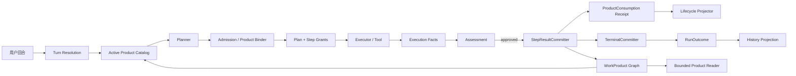
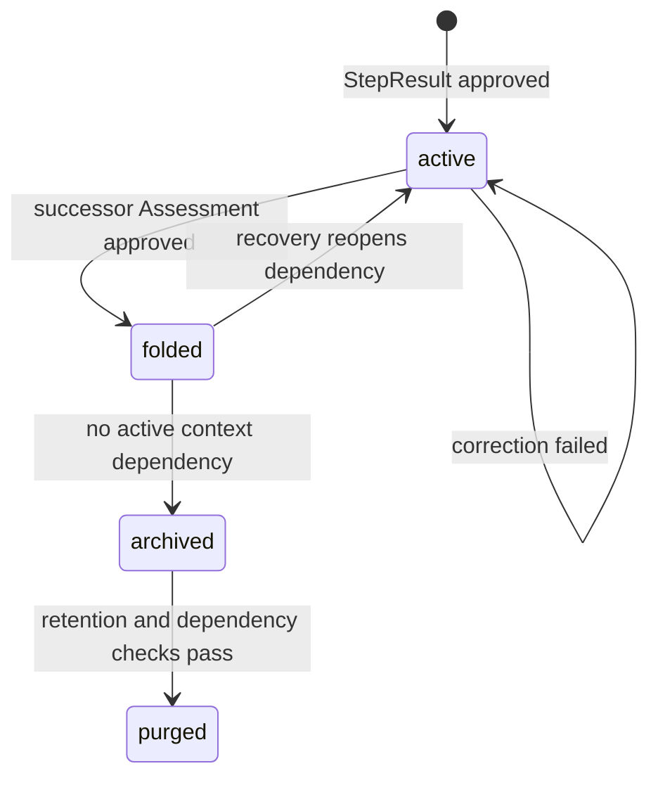

# 会话统一成果图谱与跨 Run 接续方案

版本：v1.0
日期：2026-09-20
状态：设计方案，待评审，尚未实施
范围：AgentLoop Kernel、Planner、Runtime、Assessment、TerminalCommitter、会话上下文及成果存储

## 1. 结论摘要

本方案将会话中的所有可复用、可交付、可审计成果统一为一张不可变的 `Conversation Work Product Graph`。

它包含两层结果对象：

- `StepResult`：某个 Step 通过 Assessment 后发布的步骤成果。
- `RunOutcome`：某个 Run 通过 TerminalCommitter 后发布的最终交付结果。

两层结果都只引用统一的 `WorkProduct`，不复制另一份文本内容。Run 是成果的生产活动边界，不是成果的生命周期边界；因此已完成 Step 的成果可以跨 Run 接续，失败 Run 中已经通过 Assessment 的步骤成果也可以被后续 Run 显式消费。

成果随进度通过显式消费关系逐步折叠：

```text
active -> folded -> archived -> purged
```

折叠必须由后继成果的 Assessment 认可，不能依据模型 prose、摘要或“看起来已经总结过了”自动删除过程成果。

本方案的核心收敛是：

> 会话只有一个成果语义权威；History、WorkingSet、Plan Binding 和读取工具都只能是它的投影、绑定或受限访问入口。

## 2. 目标

### 2.1 业务目标

1. 统一 Run 级、Step 级、文件级、证据级和交付级成果的语义。
2. 支持同一会话内跨 Run 继续、修改、纠错、转换和恢复。
3. 让 Agent 明确知道有哪些成果、成果是什么、能否使用以及如何声明消费关系。
4. 让过程成果在后续成果被验证吸收后退出模型活跃上下文，但保留审计和恢复能力。
5. 让结果读取基于当前 Plan/Step 的精确绑定，而不是基于“同会话 + `runId/hash`”。

### 2.2 工程目标

- 只有一个成果图谱写入边界。
- 只有一个 `StepResult` 发布边界。
- 只有 `TerminalCommitter` 可以发布 `RunOutcome`。
- 任何跨 Run 输入都必须是服务端生成并验证的 opaque `WorkProductRef`。
- 摘要、上下文裁剪和 Conversation History 不能改变成果是否存在、是否有效或是否满足证据契约。
- 成果的完整内容、来源、输入、工具事实、Assessment 和生命周期都有可追溯链路。

### 2.3 非目标

- 不把所有 Tool stdout 自动升级为成果。
- 不让 Agent 直接创建 hash、contentRef、生命周期状态或存储路径。
- 不以扩大 prompt、增加历史窗口或增加 fallback 解决语义丢失。
- 不保留长期双读双写、旧结果读取 fallback 或 workflow-specific 兼容桥。
- 不改变 Planner、Admission、Assessment、TerminalCommitter 的职责归属。

## 3. 当前状态与根因

### 3.1 当前已经存在的基础

当前 Runtime 已经具备以下基础对象和边界：

- `Plan` / `PlanStep` / `StepExecutionBinding`
- `Evidence`、Skill Compliance Assessment
- `TerminalCommitter` 和 `run_outcomes`
- `ConversationWorkingSet`
- `ConversationResultRepository` 和 `read_conversation_result`
- `ConversationResultReference`、`ConversationInputBinding`
- 内容寻址的工具结果和文件读取机制

这些能力说明系统已经有“成果需要持久化、绑定和审查”的方向，但目前各自表达了部分结果语义，没有形成一个统一对象。

### 3.2 当前结果语义的分散位置

| 当前位置 | 当前含义 | 主要问题 |
|---|---|---|
| `conversationHistory` | 用户与助手的对话展示 | 仍可能被误当作执行证据或可复用内容 |
| `plan_steps.output` | Step 文本输出 | 未统一表达文件、事实、证据和交付成果 |
| `runs.output` | Run 文本投影 | 与 Outcome 重复存储，容易漂移 |
| `run_outcomes.output` | 最终结果文本 | 只能表达一段文本，不能表达多成果交付 |
| `ConversationWorkingSet.reusableResults` | 历史 Outcome 摘要 | 形成第二套结果目录和复用语义 |
| `completedStepHandoffs` | 已完成 Step 交接 | 与 Step 输出、Evidence、Artifact 语义重复 |
| `reusableArtifacts` | 文件成果目录 | 与结果、来源和生命周期分离 |
| `Plan.inputBindings` | 历史 Outcome 输入 | 仍以 `runId + sha256 + characters` 为核心识别方式 |
| `read_conversation_result` | 历史结果读取 | 只验证 owner、conversation、Run ID、hash，没有验证本 Plan 是否绑定 |

### 3.3 第一处语义断裂

第一处根因不是 prompt 不够清楚，而是“成果发布”没有一个统一的所有权边界：

1. Step 完成时把文本写入 `plan_steps.output`。
2. Run 完成时又把文本写入 `run_outcomes.output` 和 `runs.output`。
3. `ConversationWorkingSet` 再从多个表和事件重建 `reusableResults`、handoff、artifact。
4. Agent 通过 History、WorkingSet 或结果读取工具获得不同粒度的内容。
5. 读取工具只判断“这个结果属于本会话”，没有判断“当前 Plan 是否明确绑定了它”。

因此系统无法稳定回答：

- 这个内容是 Tool 事实、Step 成果还是最终交付？
- 这个成果当前是否仍可被后续 Run 使用？
- 失败 Run 中哪些 Step 成果仍然有效？
- 新成果是否真正吸收了旧成果？
- 当前 Agent 读取的内容是否确实是本 Plan 的输入？

## 4. 总体架构



所有权矩阵：

| 模块 | 唯一职责 | 不允许做什么 |
|---|---|---|
| Tool / Executor | 产生执行事实、稳定 payload 候选和中性 receipt | 不发布 WorkProduct，不声明任务已完成 |
| Planner | 从成果目录选择输入并提出成果意图 | 不写存储引用，不决定成果有效性 |
| Admission / Binder | 验证并固化 Plan/Step 的精确成果绑定 | 不从会话历史自动补绑定 |
| Assessment | 判断候选成果、输入覆盖和消费关系是否成立 | 不直接写最终 Outcome |
| StepResultCommitter | 发布已通过 Assessment 的 StepResult 和 WorkProduct | 不接受未审查的 Agent 文本作为成果 |
| TerminalCommitter | 聚合已发布的 StepResult，发布 RunOutcome | 不绕过 Step Assessment |
| Product Repository | 保存不可变成果、来源和消费关系 | 不按会话范围开放任意历史读取 |
| WorkingSet Projector | 投影 active 成果卡片和任务游标 | 不形成第二套结果权威 |
| History Projector | 生成对话展示 | 不作为执行输入或授权依据 |

## 5. 统一成果标准

### 5.1 什么才算成果

不是所有过程数据都属于成果。只有同时满足以下条件之一，才应提升为 `WorkProduct`：

- 后续 Step 需要引用的已验证事实、结构化提取或聚合结果。
- 后续 Run 可能继续使用的中间结果。
- 已物化并通过验收的文件、表格、网页或其他 Artifact。
- 面向用户的最终交付内容。

Tool stdout、命令退出码、模型 prose、普通事件和未通过 Assessment 的候选内容，默认仍是执行事实或候选，不是正式成果。

### 5.2 WorkProduct

```ts
type ProductRole =
  | "evidence"
  | "intermediate"
  | "artifact"
  | "delivery";

type ReuseScope = "step" | "conversation";

interface WorkProductRef {
  readonly schema: "agentloop.workProductRef/v1";
  readonly productId: string; // opaque；不包含 hash、路径或模型可推导字段
}

interface WorkProduct {
  readonly id: string;
  readonly conversationId: string;
  readonly ownerUserId: string;
  readonly producer: {
    readonly runId: string;
    readonly planId: string;
    readonly stepId: string;
  };
  readonly role: ProductRole;
  readonly semanticType: string;
  readonly reuseScope: ReuseScope;
  readonly payload: {
    readonly contentRef: string; // Runtime 私有引用
    readonly mimeType: string;
    readonly characters?: number;
    readonly bytes?: number;
  };
  readonly provenance: {
    readonly inputProducts: readonly WorkProductRef[];
    readonly sourceEvidenceRefs: readonly string[];
    readonly producingToolCallIds: readonly string[];
    readonly assessmentRef: string;
  };
  readonly integrity: {
    readonly sha256: string; // 服务端维护，不能作为 Agent 输入契约
    readonly createdAt: number;
  };
  /** Current materialized lifecycle state; transitions remain append-only events. */
  readonly lifecycle: "active" | "folded" | "archived" | "purged";
}
```

`WorkProduct` 的 payload、provenance 和 integrity 发布后不可修改；`lifecycle` 是由 append-only lifecycle events 归约出的当前投影。修订不是覆盖原对象，而是创建新对象并通过 `ProductConsumption` 建立关系。

### 5.3 StepResult

`StepResult` 是 Step 的成果发布记录，不是 `plan_steps.output` 的改名。

```ts
interface StepResult {
  readonly id: string;
  readonly conversationId: string;
  readonly runId: string;
  readonly planId: string;
  readonly stepId: string;
  readonly products: readonly WorkProductRef[];
  readonly inputs: readonly WorkProductRef[];
  readonly assessmentRef: string;
  readonly evidenceRefs: readonly string[];
  readonly committedAt: number;
}
```

Step 只有在 Assessment 通过后才能产生正式 `StepResult`。一个 Step 可以产生多个成果，例如源事实、结构化表和生成文件；不再强制压缩成一段 output 文本。

### 5.4 RunOutcome

`RunOutcome` 是 Run 的最终结果容器，只引用成果，不重复保存成果内容。

```ts
interface RunOutcome {
  readonly id: string;
  readonly conversationId: string;
  readonly runId: string;
  readonly planId: string;
  readonly status: "completed" | "failed" | "cancelled";
  readonly deliveryProducts: readonly WorkProductRef[];
  readonly inputProducts: readonly WorkProductRef[];
  readonly terminalCommitRef: string;
  readonly committedAt: number;
}
```

失败或取消 Run 可以没有 `RunOutcome.deliveryProducts`，但其中已经通过 Assessment 的 `StepResult` 仍可以保留并参与后续 Run 的显式绑定。

### 5.5 消费关系

```ts
type ProductDisposition =
  | "absorbed"
  | "superseded"
  | "retained_as_provenance";

interface ProductConsumption {
  readonly input: WorkProductRef;
  readonly successor: WorkProductRef;
  readonly disposition: ProductDisposition;
  readonly coverage: {
    readonly preservedClaims: readonly string[];
    readonly omittedClaims?: readonly string[];
  };
  readonly assessmentRef: string;
  readonly createdAt: number;
}
```

`coverage` 是必须由 Skill/Assessment 语义验证的结构化数据，不能从最终回答的措辞中推断。

## 6. 跨 Run 接续模型

### 6.1 基本原则

Run 是生产活动，不是成果边界。成果以 `conversationId` 归属会话，以 `producer.runId` 记录来源。

跨 Run 只能经过以下链路：

```text
Active Product Catalog
  -> Agent 选择 WorkProductRef
  -> Admission 验证会话、用户、生命周期和复用范围
  -> PlanProductBinding
  -> Step Grant
  -> bounded read / execution
```

不能通过以下方式隐式接续：

- transcript 中出现过某段文字；
- 目标 `runId` 被模型猜中；
- WorkingSet 摘要刚好包含了内容；
- 只持有同会话的权限；
- 重新采集同一来源并假装是复用旧成果。

### 6.2 两种接续

#### 同一 Run 内恢复

Recovery 继续原 Plan，输入来自原 Plan 的 Step dependency 和已发布 `StepResult`。不需要把同一成果伪装成跨 Run 输入。

#### 新 Run 的继续、修改和纠错

新 Run 从同一会话的 `reuseScope = conversation` 且 `lifecycle = active` 的成果目录选择输入。新 Plan 显式保存绑定。

```ts
interface PlanProductBinding {
  readonly schema: "agentloop.planProductBinding/v1";
  readonly planId: string;
  readonly product: WorkProductRef;
  readonly relation: "continue" | "refine" | "correct" | "challenge";
  readonly boundAt: number;
}
```

`relation` 只表达用户如何处理旧成果；它不自动意味着旧成果会被折叠。是否折叠由新成果通过 Assessment 后提交 `ProductConsumption` 决定。

### 6.3 跨 Run 读取授权

当前 `read_conversation_result(runId, sha256)` 应替换为：

```ts
read_work_product({
  productId: string,
  offset?: number,
  maxCharacters?: number,
})
```

授权条件：

```ts
assert(product.lifecycle === "active");
assert(product.reuseScope === "conversation");
assert(product.conversationId === grant.conversationId);
assert(product.ownerUserId === grant.actorUserId);
assert(product.productId in grant.boundProductRefs);
assert(product.productId is allowed for grant.planId and grant.stepId);
```

读取工具不接受模型传入 hash 来建立身份。完整性 hash 由 Runtime 用于校验内容；Agent 只使用 opaque `productId`。

### 6.4 失败 Run 的成果接续

失败 Run 不应整体视为“没有成果”：

| Run 状态 | Step 状态 | 是否可跨 Run |
|---|---|---|
| completed | Assessment approved | 可以 |
| failed | Assessment approved | 可以，按 `reuseScope` |
| cancelled | Assessment approved | 可以，按 `reuseScope` |
| 任意 | 只有 Tool fact，未通过 Assessment | 不可以作为正式成果 |
| 任意 | Step failed | 不可以作为成功成果；可作为诊断 provenance |

这使得“部分完成的事实获取”可以被后续 Run 继续使用，同时避免把未经评估的半成品当成事实。

## 7. Agent 数据协议

Agent 需要清楚理解成果结构，但不应拥有存储和生命周期权限。模型看到的是服务器生成的成果卡片：

```ts
interface ProductCardForAgent {
  readonly ref: WorkProductRef;
  readonly role: ProductRole;
  readonly semanticType: string;
  readonly title: string;
  readonly summary: string;
  readonly producer: { readonly runId: string; readonly stepId: string };
  readonly status: "active";
  readonly readHint: "read_work_product";
}
```

Agent 必须遵守以下协议：

1. 使用历史成果时，在 Plan 中选择精确 `productId`。
2. 需要完整内容时，只调用 `read_work_product`。
3. 生成可复用内容时，声明成果角色、语义类型、输入成果和工具事实。
4. 修改、纠错或总结旧成果时，声明消费关系和保留/遗漏的 claims。
5. 只有把已发布成果标为 delivery candidate，才能进入最终交付选择。
6. 不创建 hash、contentRef、路径、lifecycle 或 assessment 结果。

Agent 提交的是成果意图：

```ts
interface StepProductIntent {
  readonly produced: readonly {
    readonly role: ProductRole;
    readonly semanticType: string;
    readonly reuseScope: ReuseScope;
    readonly basedOnToolCallIds: readonly string[];
    readonly basedOnProducts: readonly WorkProductRef[];
  }[];
  readonly consumes: readonly ProductConsumptionIntent[];
}

interface ProductConsumptionIntent {
  readonly input: WorkProductRef;
  readonly disposition: ProductDisposition;
  readonly preservedClaims: readonly string[];
  readonly omittedClaims?: readonly string[];
}
```

Runtime 根据稳定工具 payload、授权输入和 Assessment 结果创建实际 `WorkProduct`。Agent 的结构化意图不能单独构成成果。

## 8. 成果生命周期与逐步折叠



### 8.1 状态含义

- `active`：可被符合条件的后续 Plan 选择。
- `folded`：内容已经被已验证的后继成果吸收或替代，默认不进入模型上下文。
- `archived`：不参与普通规划，但保留 payload 以支持审计和恢复。
- `purged`：删除 payload，保留 tombstone、lineage、integrity 和消费记录。

### 8.2 折叠条件

某个输入成果只有同时满足以下条件才可以折叠：

1. 后继成果已经通过 Assessment。
2. `ProductConsumption` 明确引用它。
3. `coverage` 说明被保留的 claims 以及省略的 claims。
4. 没有 active Plan、Recovery、HIL、Step Grant 仍依赖原成果。
5. 没有用户要求保留原始版本作为对照或审计输入。

失败的后继 Run 不触发折叠。修订成功后，旧成果通常标记为 `superseded`；单纯格式转换可以标记为 `retained_as_provenance`，不应误认为事实被替代。

## 9. 关键流程伪码

### 9.1 创建跨 Run 输入绑定

```ts
async function bindPlanProducts(input: {
  actorUserId: string;
  conversationId: string;
  planId: string;
  selected: readonly WorkProductRef[];
  relation: PlanProductBinding["relation"];
}) {
  for (const ref of input.selected) {
    const product = await products.get(ref.productId);
    assert(product !== undefined);
    assert(product.conversationId === input.conversationId);
    assert(product.ownerUserId === input.actorUserId);
    assert(product.lifecycle === "active");
    assert(product.reuseScope === "conversation");
  }

  return db.transaction(async () => {
    const bindings = await planBindings.insertAll(input);
    await grants.pinForPlan(bindings);
    return bindings;
  });
}
```

### 9.2 发布 StepResult

```ts
async function commitStepResult(input: {
  runId: string;
  planId: string;
  stepId: string;
  productIntent: StepProductIntent;
}) {
  const assessment = await assessments.latest(input.planId, input.stepId);
  if (assessment?.approved !== true) {
    throw new AssessmentError("StepResult requires an approved Assessment");
  }

  await grants.assertAllInputsAllowed(input.planId, input.stepId, input.productIntent);
  await executionFacts.assertAllReferencedToolCallsCommitted(input.productIntent);

  return db.transaction(async () => {
    const products = await productCommitter.promoteStablePayloads({
      runId: input.runId,
      planId: input.planId,
      stepId: input.stepId,
      intent: input.productIntent,
      assessmentRef: assessment.id,
    });

    const result = await stepResults.insert({
      runId: input.runId,
      planId: input.planId,
      stepId: input.stepId,
      products: products.map(ref),
      inputs: referencedInputs(input.productIntent),
      assessmentRef: assessment.id,
    });

    await plans.completeStepWithResult(input.planId, input.stepId, result.id);
    await lifecycle.recordConsumption(input.productIntent.consumes, assessment.id);
    return result;
  });
}
```

### 9.3 发布 RunOutcome

```ts
async function commitRunOutcome(runId: string, planId: string) {
  const plan = await plans.get(planId);
  const leaves = activeLeafSteps(plan);
  const results = await stepResults.forSteps(leaves.map(step => step.id));

  assertEveryLeafCompletedAndAssessed(leaves, results);

  const deliveryProducts = selectDeliveryProducts(results);
  if (deliveryProducts.length === 0) {
    throw new AssessmentError("Terminal commit requires a delivery WorkProduct");
  }

  return db.transaction(async () => {
    const outcome = await outcomes.insert({
      runId,
      planId,
      deliveryProducts,
      inputProducts: await planBindings.refs(planId),
    });

    await runs.completeWithoutDuplicatedOutput(runId, outcome.id);
    await lifecycle.releaseConsumedInputGrants(planId);
    return outcome;
  });
}
```

### 9.4 读取成果

```ts
async function readWorkProduct(
  grant: ExecutionGrant,
  input: { productId: string; offset: number; maxCharacters: number },
) {
  await grants.assertBoundProduct({
    grantId: grant.id,
    planId: grant.planId,
    stepId: grant.stepId,
    productId: input.productId,
  });

  return productPayloads.readBounded(
    input.productId,
    input.offset,
    input.maxCharacters,
  );
}
```

## 10. 存储改造

### 10.1 新增逻辑表

```text
work_products
  id, conversation_id, owner_user_id
  producer_run_id, producer_plan_id, producer_step_id
  role, semantic_type, reuse_scope
  content_ref, mime_type, sha256, characters, bytes
  assessment_id, created_at

step_results
  id, conversation_id, run_id, plan_id, step_id
  assessment_id, committed_at

step_result_products
  step_result_id, product_id, position

step_result_inputs
  step_result_id, product_id

run_outcome_products
  outcome_id, product_id, role, position

plan_product_bindings
  plan_id, product_id, relation, bound_at

product_consumptions
  input_product_id, successor_product_id
  disposition, coverage_json, assessment_id, created_at

product_lifecycle_events
  product_id, from_state, to_state, reason, created_at
```

成果正文继续使用现有内容寻址能力，但 `content_ref` 只存在于 Runtime 存储层，不作为 Agent 的身份协议。

### 10.2 现有字段替换关系

| 现有对象 | 改造后 |
|---|---|
| `plan_steps.output` | `plan_steps.step_result_id`，正文由 `StepResult -> WorkProduct` 引用 |
| `plan_steps.evidence_json` | 保留为 Step Assessment/Evidence 投影，不能代替成果对象 |
| `runs.output` | 删除成果语义；只保留状态和 `run_outcome_id` 投影（或直接移除） |
| `run_outcomes.output` | 删除；使用 `run_outcome_products` |
| `ConversationWorkingSet.reusableResults` | 从 `ActiveWorkProductIndex` 投影 |
| `completedStepHandoffs` | 从已发布 `StepResult` 投影，不再独立保存结果正文 |
| `reusableArtifacts` | 作为 `role = artifact` 的 `WorkProduct` 投影 |
| `Plan.inputBindings` | 改为 `plan_product_bindings` 的 `WorkProductRef[]` |
| `read_conversation_result` | 替换为受 Grant 约束的 `read_work_product` |

## 11. WorkingSet、History 与 Agent Context 的新职责

### 11.1 WorkingSet

`ConversationWorkingSet` 变成轻量投影，只包含：

- 当前 active 的 ProductCard；
- active Goal 和 Plan 游标；
- 失败边界和恢复提示；
- 推荐能力；
- 成果关系的有限摘要。

它不再是 `reusableResults`、handoff 和 artifact 的第二套内容存储。

### 11.2 Conversation History

History 只回答“用户和助手之前说过什么”，不能回答：

- 哪些内容通过 Assessment；
- 哪些成果当前可读取；
- 哪些成果绑定了当前 Plan；
- 哪些成果已被后续结果吸收。

这些问题只能由 Work Product Graph 和当前 Grant 回答。

### 11.3 Agent Context

Agent Context 按当前 Step 生成：

```text
任务语义
  + 当前 Step 目标
  + 当前 Step 已授权的 ProductCard
  + 当前 Step 的输入绑定
  + 可调用的 read_work_product 工具
  + 产出成果意图 schema
```

模型只看到必要的卡片摘要，完整内容必须按绑定的 ProductRef 读取。摘要被裁剪不影响成果存在和证据状态。

## 12. 迁移方案

本方案采用一次性语义切换，不保留长期双读双写。

### 阶段 0：冻结契约和基线

- 冻结 `WorkProduct`、`StepResult`、`RunOutcome`、`ProductConsumption` schema。
- 增加跨 Run、失败 Run 部分成果、修订失败和折叠回收的回归 fixture。
- 记录当前 `run_outcomes`、`plan_steps`、WorkingSet 和读取工具的基线行为。

### 阶段 1：建立成果存储和一次性历史迁移

- 创建新表和索引。
- 对已完成且有通过 Assessment 的旧 Step 输出，生成历史 `StepResult + WorkProduct`。
- 对已完成 `run_outcomes`，生成历史 delivery `WorkProduct + RunOutcome`。
- 无法证明已通过 Assessment 的旧文本，只进入 audit archive，不可作为新的正式输入。
- 为导入对象记录 `legacy_import` provenance；导入完成后新代码不再从旧 output 字段读取成果。

### 阶段 2：切换写入边界

- 实现 `StepResultCommitter`。
- `TerminalCommitter` 改为只聚合 StepResult ProductRef。
- 所有 Step/Run 完成路径停止写成果正文到 `plan_steps.output`、`runs.output`、`run_outcomes.output`。
- 旧字段在同一迁移发布中清空或删除，不作为 fallback。

### 阶段 3：切换跨 Run 输入和读取

- Planner context 替换为 ProductCard catalog。
- `Plan.inputBindings` 改为精确 `WorkProductRef[]`。
- Admission 建立 Plan/Step grant。
- 删除 `read_conversation_result` 的执行入口，接入 `read_work_product`。
- 禁止模型提交 hash、contentRef、路径来取得成果身份。

### 阶段 4：切换投影和生命周期

- WorkingSet 从成果图谱投影 active ProductCard。
- History 只作为对话投影。
- 启用 `ProductConsumption` 及 `active -> folded -> archived -> purged` 状态机。
- 增加恢复安全检查，确认没有 active Plan、Recovery、HIL 或 Grant 依赖后才允许 purge。

### 阶段 5：删除旧语义

- 删除旧结果 repository、旧输入绑定类型和未使用的输出列。
- 删除所有按 `runId + sha256` 浏览结果的查询。
- 用结构搜索、类型检查和数据库 schema 检查确认不存在第二套结果写入路径。

## 13. 验收标准

### 13.1 结构验收

- `WorkProduct` 是唯一成果正文身份。
- `StepResult` 和 `RunOutcome` 不复制成果正文。
- WorkingSet、History、Plan binding 和 Reader 均不能成为独立成果来源。
- 新的读取工具必须校验当前 Plan/Step Grant。

### 13.2 跨 Run 验收

- Run 1 完成的交付可以被 Run 2 显式绑定并读取。
- Run 1 失败但某个 Step 已通过 Assessment 时，Run 2 可以消费该 StepResult。
- Run 2 未绑定 Run 1 的成果时，即使知道 `runId`、hash 或摘要，也不能读取。
- Run 2 失败时，Run 1 原成果仍保持 active。
- Run 2 成功修订后，旧成果根据显式消费关系进入 folded/superseded，而不是直接删除。

### 13.3 Agent 协议验收

- Agent 能从 ProductCard 区分 evidence、intermediate、artifact 和 delivery。
- Agent 能正确选择 ProductRef，不需要传 hash。
- Agent 不能自行创建 contentRef、生命周期状态或 Assessment 结论。
- 无效 ProductRef、未绑定 ProductRef、已 archived ProductRef 都被 Runtime 拒绝。

### 13.4 生命周期验收

- 未通过 Assessment 的候选不会产生正式 WorkProduct。
- 消费 receipt 缺少覆盖范围时不能折叠旧成果。
- 有 active grant 依赖的成果不能 purge。
- purge 后仍保留最小 tombstone 和 lineage，审计关系可重建。

### 13.5 重启和恢复验收

- Runtime 重启后可从数据库重建 Product Graph、StepResult、Outcome、Binding 和生命周期状态。
- Recovery 不重新采集已经绑定且仍有效的成果。
- Plan revision 不会丢失原 Plan 的成果输入链。

## 14. 可获得的收益

### 14.1 语义收益

- Agent 面对的是一套明确的成果语言，而不是多个相互重叠的历史字段。
- “过程事实、步骤成果、最终交付”被严格区分。
- 跨 Run 接续从特殊逻辑变成图谱上的普通引用边。

### 14.2 可靠性收益

- 消除 `runs.output`、`plan_steps.output`、`run_outcomes.output` 和 WorkingSet 之间的内容漂移。
- 避免同会话任意结果读取造成错误复用和数据越权。
- 失败 Run 的有效部分可以保留，减少重复采集和重复执行。
- 上下文压缩不再决定成果是否存在。

### 14.3 成本收益

- 后续 Run 不需要为了得到已有结果重新采集来源。
- Agent 只获取 ProductCard，完整内容按需读取，减少无界历史注入。
- 成果折叠减少重复上下文，同时保留审计和恢复能力。

### 14.4 可运营收益

- 可以直接回答“这个交付由哪些 Step 产生、消费了哪些成果、哪些旧成果被替代”。
- 可以统计成果复用率、重复采集率、折叠率、失败 Run 的有效成果保留率。
- 可以对跨 Run 错误复用、未经绑定读取和不完整消费覆盖做结构化告警。

## 15. 评审时需要明确的决策

以下内容建议在实施前确认：

1. `reuseScope = conversation` 的默认范围是否只允许同用户、同会话，跨会话是否永不开放。
2. 失败 Run 中通过 Assessment 的 intermediate 是否默认可跨 Run，还是必须由 Skill 声明可复用。
3. `RunOutcome` 是否允许多个 delivery products；建议允许，以支持多文件、多格式交付。
4. 旧 `runs.output` 是否在迁移后立即删除，还是只保留为短期非权威审计列；语义上都不得再读取。
5. `coverage.preservedClaims` 是否由通用 Assessment 负责格式校验、由 Skill 负责业务语义验证；建议采用这一分工。
6. purge 的默认保留期和法律/审计保留策略应由部署配置决定，不能写死在通用 Runtime。

## 16. 最终判断

这不是给现有 `reusableResults` 再加一个字段，也不是把 `read_conversation_result` 的校验条件继续加长。真正需要改的是成果的所有权边界：

```text
Tool facts
  -> Assessment
  -> StepResult
  -> WorkProduct Graph
  -> explicit Plan binding
  -> next Step / next Run
  -> TerminalCommitter
  -> RunOutcome
```

完成这次收敛后，Agent 才能在一个稳定、可解释、可授权的数据结构上工作；跨 Run 接续、失败部分复用、成果逐步折叠和最终交付都由同一条成果链解释，不再依赖 History、WorkingSet 摘要或模型自行猜测。
