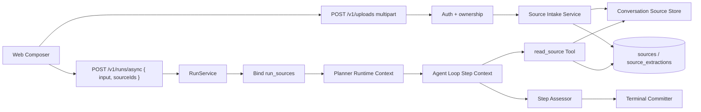
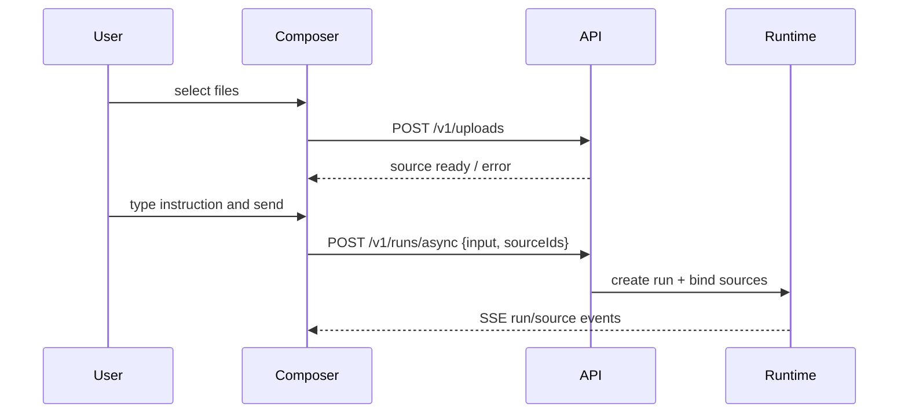

# 前端文件上传与 Runtime 文件解读设计方案

版本：v0.1
日期：2026-08-20
状态：设计稿

## 1. 设计结论

文件上传能力不应被实现为“前端把文件内容拼进用户输入”，也不应只作为 UI 附件挂在 Conversation 上。正确边界是：

> 上传文件先进入服务端 Source Intake，经过认证、落盘、校验、抽取和持久化后成为 Runtime 的 canonical source facts；Planner、执行 Step、Assessor 和 Terminal Committer 都只能基于这些持久事实工作。

这意味着：

- 前端只负责选择文件、展示上传/抽取状态、把 `sourceIds` 随 Run 请求提交。
- HTTP 层负责认证、限流、multipart 接入、上传对象创建和所有权校验。
- Source Intake 负责文件安全校验、内容抽取、分块、摘要、错误归类和持久化。
- Runtime 把文件事实投影进 planning/execution context，但不把大文件全文伪造成用户消息。
- LLM 可以基于文件摘要规划，也可以通过受控 `read_source` 工具按需读取 chunk/range。
- 上传成功、抽取成功、文件读取成功都不是 Run 完成证据；完成仍必须经过 Plan、Assessment、DeliveryCandidate 和 Terminal Committer。

## 2. 当前边界

当前实现仍是纯文本任务入口：

- `src/http/server.ts` 的 `/v1/runs/async` 和 `/v1/runs` 只读取 JSON body，并把 `body.input` 传给 `RunService`。
- `RunService.start/execute` 与会话入口 `startConversation/executeConversation` 都接受字符串 `input`，最大 200,000 字符；HTTP 会话请求使用后者。
- `web/src/components/Composer.tsx` 只维护 textarea draft，没有附件状态。
- Planner 只接收 `TaskSpec.input`、conversation history、Skill catalog 和 Tool catalog。
- 执行阶段的 `buildStepRuntimeContext(...)` 只描述 Plan Step、Skill 和 workspace root。

因此，文件能力要新增一条完整 intake 链路，而不是局部扩大 `input` 字段。

## 3. 范围与非目标

### 3.1 必须具备

- 从 Web 前端选择一个或多个文件并提交到当前会话/下一次 Run。
- 支持常见文本和办公文档解读：`txt`、`md`、`csv`、`json`、`html`、`pdf`、`docx`、`xlsx`、`pptx`。
- 每个上传文件生成稳定 `sourceId`，持久记录文件名、MIME、大小、sha256、存储位置、抽取状态和错误原因。
- Run 创建时显式绑定 `sourceIds`，形成可审计的 `run_sources` 关系。
- Planner 能看到文件清单、抽取摘要和可用引用。
- 执行 Step 能按需读取文件 chunk，且读取行为产生 Tool evidence。
- 对 unreadable、unsupported、oversized、extract_failed 做 typed failure，不静默丢弃。
- Conversation 删除时清理或 tombstone 关联 Source，运行中的 Run 禁止删除。

### 3.2 明确不是第一阶段目标

- 不做任意二进制文件分析。
- 不把完整大文件直接注入模型上下文。
- 不让模型通过上传路径访问服务器任意文件。
- 不在前端本地解析敏感文件后把内容发给模型。
- 不把 OCR、病毒扫描、向量检索、跨会话文件库作为 MVP 必需项。
- 不让文件解析结果绕过 Runtime 规划、评估和终态提交。

## 4. 总体架构



职责边界：

| 组件 | 拥有的决定 | 不能决定的事项 |
|---|---|---|
| Web Composer | 文件选择、上传进度、附件删除、发送时提交 `sourceIds` | 文件是否可信、Run 是否完成 |
| HTTP Upload Route | 认证、multipart 限流、基本 MIME/大小校验 | 文件业务含义 |
| Source Intake Service | 落盘、hash、抽取、分块、摘要、错误分类 | Planner 该怎么执行任务 |
| SourceRepository | Source 元数据、抽取结果和 Run 绑定 | 模型上下文裁剪策略 |
| Planner | 根据用户目标和 source facts 形成 Plan | 读取未授权文件或声明完成 |
| `read_source` Tool | 受控读取 chunk/range/search result | 修改 Source 或扩大授权 |
| Assessor | 判断结果是否满足 Step 标准 | 推断上传/抽取成功等于任务完成 |
| Terminal Committer | 原子提交 Delivery/Outcome | 根据 UI 附件直接完成 Run |

## 5. 数据模型

### 5.1 Source 元数据

新增 `sources` 表：

```sql
CREATE TABLE sources (
  id TEXT PRIMARY KEY,
  owner_user_id TEXT NOT NULL REFERENCES users(id) ON DELETE CASCADE,
  conversation_id TEXT REFERENCES conversations(id) ON DELETE CASCADE,
  created_by_run_id TEXT REFERENCES runs(id) ON DELETE SET NULL,
  original_name TEXT NOT NULL,
  mime_type TEXT NOT NULL,
  extension TEXT NOT NULL,
  byte_size INTEGER NOT NULL,
  sha256 TEXT NOT NULL,
  storage_path TEXT NOT NULL,
  status TEXT NOT NULL CHECK(status IN (
    'uploaded',
    'extracting',
    'ready',
    'unsupported',
    'oversized',
    'unreadable',
    'extract_failed',
    'deleted'
  )),
  error_code TEXT,
  error_message TEXT,
  created_at INTEGER NOT NULL,
  updated_at INTEGER NOT NULL
);

CREATE INDEX sources_owner_conversation_idx
  ON sources(owner_user_id, conversation_id, created_at DESC);
CREATE INDEX sources_sha_idx ON sources(owner_user_id, sha256);
```

说明：

- `storage_path` 必须是服务端生成路径，不接受客户端路径。
- 同一用户同一 sha256 可以去重，也可以先只记录重复对象；MVP 不强制对象级去重。
- `conversation_id` 可以在上传时为空，发送 Run 时 claim 到目标 Conversation；一旦绑定后不可跨会话移动。

### 5.2 抽取结果

新增 `source_extractions` 表：

```sql
CREATE TABLE source_extractions (
  id TEXT PRIMARY KEY,
  source_id TEXT NOT NULL REFERENCES sources(id) ON DELETE CASCADE,
  extractor TEXT NOT NULL,
  extractor_version TEXT NOT NULL,
  text_content TEXT,
  structured_json TEXT,
  summary TEXT,
  token_estimate INTEGER NOT NULL,
  character_count INTEGER NOT NULL,
  truncated INTEGER NOT NULL CHECK(truncated IN (0, 1)),
  created_at INTEGER NOT NULL
);

CREATE INDEX source_extractions_source_idx
  ON source_extractions(source_id, created_at DESC);
```

`text_content` 保存可控上限内的抽取文本。大文件应只保存 summary 和 chunks，避免把整份文件重复写入 SQLite。

### 5.3 Source Chunk

新增 `source_chunks` 表：

```sql
CREATE TABLE source_chunks (
  source_id TEXT NOT NULL REFERENCES sources(id) ON DELETE CASCADE,
  chunk_index INTEGER NOT NULL,
  kind TEXT NOT NULL CHECK(kind IN ('text', 'table', 'slide', 'page', 'sheet', 'metadata')),
  locator TEXT NOT NULL,
  content TEXT NOT NULL,
  token_estimate INTEGER NOT NULL,
  sha256 TEXT NOT NULL,
  created_at INTEGER NOT NULL,
  PRIMARY KEY(source_id, chunk_index)
);
```

`locator` 示例：

- PDF：`page=3`
- DOCX：`paragraph=42`
- XLSX：`sheet="收入表"; rows=1-100`
- PPTX：`slide=8`
- CSV：`rows=1-200`

### 5.4 Run 绑定

新增 `run_sources` 表：

```sql
CREATE TABLE run_sources (
  run_id TEXT NOT NULL REFERENCES runs(id) ON DELETE CASCADE,
  source_id TEXT NOT NULL REFERENCES sources(id) ON DELETE RESTRICT,
  position INTEGER NOT NULL,
  role TEXT NOT NULL CHECK(role IN ('user_supplied', 'derived')),
  created_at INTEGER NOT NULL,
  PRIMARY KEY(run_id, source_id),
  UNIQUE(run_id, position)
);
```

规则：

- 一个 Run 只能绑定同 owner、同 conversation 或尚未 claim 的 Source。
- 绑定发生在 Run 创建事务内，保证 `run.started` 事件和 `run_sources` 一致。
- 对话后续轮次默认可引用同会话历史 Source，但最新 Run 的 `sourceIds` 要显式记录，以区分“本轮新提交”和“会话已有资料”。

## 6. 存储路径与安全约束

服务端生成路径：

```text
workspaceRoot/
  conversations/
    <conversationId>/
      sources/
        <sourceId>/
          original
          extracted/
            chunks.jsonl
            preview.txt
```

安全规则：

1. `conversationId`、`sourceId` 必须通过安全 segment 校验。
2. 目录创建后使用 `lstat` 和 `realpath` 校验，禁止符号链接。
3. 原始文件落盘时先写临时文件，再原子 rename。
4. `storage_path` 永远由服务端拼接，不能来自 multipart filename。
5. MIME 只能作为参考，最终以扩展名、magic bytes 和 extractor 可读性共同决定。
6. 默认单文件上限建议 25 MB，单 Run 总上传上限建议 100 MB；可配置。
7. 抽取文本上限、chunk 上限和模型上下文上限分开控制。
8. 文件读取工具只能读取 `run_sources` 或同 conversation 已授权 Source。

## 7. API 设计

### 7.1 上传文件

```http
POST /v1/uploads
Authorization: Bearer <token>
Content-Type: multipart/form-data

fields:
  file: binary
  conversationId?: string
```

响应：

```json
{
  "source": {
    "id": "src_...",
    "originalName": "经营数据.xlsx",
    "mimeType": "application/vnd.openxmlformats-officedocument.spreadsheetml.sheet",
    "byteSize": 182736,
    "sha256": "...",
    "status": "ready",
    "summary": "包含 3 个工作表：收入、成本、区域汇总..."
  }
}
```

MVP 可以同步抽取并返回 `ready/extract_failed`。若文件较大，后续可演进为：

- 上传立即返回 `uploaded/extracting`。
- 前端订阅 `source.extracted` 事件或轮询 `GET /v1/sources/:id`。
- Run 创建时如果 Source 仍在 extracting，Runtime 可等待短预算或进入 typed ask-user/blocked gap。

### 7.2 创建 Run

扩展现有 JSON：

```json
{
  "input": "分析这个表格，找出收入异常波动并给出原因假设",
  "sourceIds": ["src_..."],
  "allowDangerousTools": true,
  "conversationId": "..."
}
```

后端校验：

- `sourceIds` 最多 20 个。
- Source 必须属于当前用户。
- Source 状态必须是 `ready`，或允许进入 typed source gap。
- Source 的 conversation 必须为空或等于目标 conversation。
- 已绑定到其他 conversation 的 Source 不能被复用。

### 7.3 查询 Source

```http
GET /v1/sources/:sourceId
GET /v1/conversations/:conversationId/sources
```

用于前端展示已上传资料。默认不返回全文，只返回 metadata、status、summary、chunk count。

### 7.4 删除 Source

```http
DELETE /v1/sources/:sourceId
```

规则：

- 如果有关联 running Run，返回 `409 CONFLICT`。
- 已完成 Run 的 Source 可 tombstone，不应破坏历史审计；物理清理由后台 retention job 做。

## 8. Extractor 设计

新增 `SourceExtractor` 接口：

```ts
interface SourceExtractor {
  readonly name: string;
  readonly version: string;
  supports(input: SourceFile): boolean;
  extract(input: SourceFile, signal?: AbortSignal): Promise<SourceExtraction>;
}

interface SourceExtraction {
  readonly text?: string;
  readonly structured?: unknown;
  readonly summary: string;
  readonly chunks: readonly SourceChunkDraft[];
  readonly tokenEstimate: number;
  readonly truncated: boolean;
}
```

MVP extractor：

| 类型 | 策略 |
|---|---|
| `txt/md` | UTF-8 解码，保留段落，按字符/token 分块 |
| `csv` | 解析 header、行数、列数、样例行、基础统计，chunks 按行段 |
| `json` | 解析 JSON，生成路径摘要和压缩 pretty text |
| `html` | 去脚本样式，抽取可见文本和标题层级 |
| `pdf` | 使用稳定 PDF 文本抽取库，chunk locator 为 page |
| `docx` | 解包 Office Open XML，抽取段落、标题、表格 |
| `xlsx` | 按 sheet 抽取维度、表头、样例、数值列统计，必要时保存表格 chunks |
| `pptx` | 按 slide 抽取标题、正文、备注和表格 |

错误分类：

| 错误 | Source 状态 | Runtime 处理 |
|---|---|---|
| 扩展名不支持 | `unsupported` | 提示用户换格式或明确无法分析 |
| 文件超过硬限制 | `oversized` | 提示拆分或压缩 |
| 文件损坏/加密 | `unreadable` | ask-user，要求重新上传或提供密码/文本 |
| extractor 崩溃 | `extract_failed` | 记录 traceId，Run 可失败或 ask-user |
| 抽取后超上下文预算 | `ready` + `truncated=1` | Planner 看摘要，执行用 `read_source` 按需读 chunk |

## 9. Runtime Context 接入

### 9.1 TaskSpec

扩展 `TaskSpec`：

```ts
interface TaskSourceSummary {
  readonly id: string;
  readonly originalName: string;
  readonly mimeType: string;
  readonly byteSize: number;
  readonly sha256: string;
  readonly status: SourceStatus;
  readonly summary?: string;
  readonly chunkCount: number;
  readonly truncated: boolean;
}

interface TaskSpec {
  readonly input: string;
  readonly sources?: readonly TaskSourceSummary[];
}
```

Planner 的 runtime context 增加：

```xml
<source_context source="server">
{
  "sources": [
    {
      "id": "src_...",
      "name": "经营数据.xlsx",
      "mimeType": "...",
      "status": "ready",
      "summary": "...",
      "chunkCount": 12,
      "truncated": false
    }
  ]
}
</source_context>
```

注意：source context 是 server-authored runtime context，不是 user message。用户输入仍保持原始 `input`。

### 9.2 执行 Step Context

`buildStepRuntimeContext(...)` 增加：

- 当前 Run 绑定的 source summary。
- 当前 Step 可见的 source refs。
- `read_source` 工具的使用约束。
- 文件抽取失败或缺失时的 typed gap。

示例：

```text
Available sources:
- src_123: 经营数据.xlsx, ready, 3 sheets, 12 chunks, sha256=...
Use read_source to inspect exact chunks before citing details not present in the summary.
Do not claim the file was fully analyzed unless relevant chunks were inspected or the source is small enough to be fully projected.
```

### 9.3 Context Budget

预算规则：

- 小文本文件可内联到 source context，但必须有硬上限。
- 大文件只进入摘要和 chunk refs。
- `read_source` 返回内容也走现有 ContextAssembler 的工具结果剪枝/摘要机制。
- chunk 内容进入模型后要留下 Tool evidence，供 Assessor 判断分析是否有依据。

## 10. `read_source` Tool

新增非危险工具：

```ts
{
  name: "read_source",
  description: "Read authorized uploaded source chunks for the current Run or conversation.",
  inputSchema: {
    type: "object",
    additionalProperties: false,
    required: ["sourceId"],
    properties: {
      sourceId: { type: "string" },
      chunkIndex: { type: "integer", minimum: 0 },
      range: { type: "string" },
      query: { type: "string" },
      maxChunks: { type: "integer", minimum: 1, maximum: 10 }
    }
  }
}
```

权限校验：

1. `grant.actorUserId` 必须拥有 Source。
2. `grant.runId` 必须绑定 Source，或 Source 属于同 conversation 的历史资料且策略允许 follow-up 引用。
3. Tool 只能返回抽取后的 chunk，不直接暴露任意文件系统路径。
4. 每次调用记录 `tool.completed`，包括 `sourceId`、chunk indexes、sha256 和返回字符数。

返回示例：

```json
{
  "sourceId": "src_123",
  "chunks": [
    {
      "chunkIndex": 3,
      "locator": "sheet=\"收入\"; rows=201-400",
      "sha256": "...",
      "content": "..."
    }
  ]
}
```

## 11. Planner 与 Skill 选择

有文件并不意味着必须选择某个 Skill。Planner 应根据任务和文件类型选择：

- 普通问答/摘要：无 Skill，使用 `read_source`。
- 文档生成：选择文档/报告类 Skill，并用 `read_source` 获取事实依据。
- 表格分析：可先无 Skill，用 `read_source` + 计算工具；若后续有 xlsx Skill，再按目录选择。
- PPT/PDF 重构：选择对应 Skill，但 Skill 正文仍必须通过 `load_skill` 激活。

Admission 规则补充：

- 如果 Plan Step 声称要分析文件，但未包含 `read_source` 或其他可读取 Source 的工具，Planner 应被修复。
- 如果 Source 状态不是 `ready`，Planner 不应假设文件内容可用。
- 如果任务要求“基于上传文件”，最终成功标准应包含“引用/检查相关 source chunk 或抽取摘要”。

## 12. Assessor 与完成证据

StepEvidence 应保留：

- `read_source` ToolCalls。
- 被读取的 sourceId/chunk/sha256。
- 候选输出中的关键结论。
- 若只基于 summary，需明确 summary 覆盖范围。

Assessor 判断规则：

- 上传成功不是分析成功。
- 抽取成功不是分析成功。
- 模型声称“已阅读文件”但没有 source evidence，应拒绝。
- 对大文件，若只读取少量 chunk，却声称全面审计，应拒绝或要求限定结论范围。
- 文件解析失败时，正确输出应说明无法分析的具体 source 状态，并给出下一步，而不是编造内容。

Terminal Committer 仍是唯一终态提交者：

```text
Plan admitted
  -> Step uses source facts / read_source evidence
  -> Assessment approved
  -> DeliveryCandidate
  -> TerminalCommitter Delivery/Outcome
```

## 13. 前端设计

Composer 增加：

- 附件按钮。
- 已选文件列表：文件名、大小、状态、删除按钮。
- 上传进度：`queued/uploading/extracting/ready/error`。
- 发送按钮在必要文件未 ready 时禁用，或允许发送后由 Runtime 返回明确状态。

交互流程：



Run 详情页展示：

- 本轮绑定文件。
- 抽取状态和错误。
- `read_source` 活动记录。
- 最终输出中可显示来源引用，但不要把 source path 暴露给用户。

## 14. 事件与可观测性

新增事件：

```text
source.uploaded
source.claimed
source.extraction.started
source.extraction.completed
source.extraction.failed
source.bound_to_run
source.read
```

事件 payload 必须包含：

- `sourceId`
- `runId` 或 `conversationId`
- `status`
- `byteSize`
- `sha256`
- `extractor`
- `chunkCount`
- `truncated`
- `errorCode` / `traceId`，如有

不要在事件里塞完整文件内容或大段抽取文本。UI 需要内容预览时，通过受控 API 单独读取摘要。

## 15. 分阶段实施

### Phase 1：最小可用闭环

1. 新增 `SourceRepository` 和数据库表。
2. 新增 `SourceIntakeService`，支持 `txt/md/csv/json`。
3. 新增 `POST /v1/uploads` 和 `GET /v1/sources/:id`。
4. `RunService.start/execute` 及会话入口接收 `sourceIds` 并绑定 `run_sources`。
5. Planner runtime context 增加 source summary。
6. 新增 `read_source` Tool，支持按 chunkIndex 读取。
7. Composer 增加附件上传和发送绑定。
8. 测试：上传 CSV 后让 Run 分析异常行，验证 Plan、Tool evidence、Assessment、Outcome。

### Phase 2：办公文档与大文件

1. 支持 `pdf/docx/xlsx/pptx/html` extractor。
2. 支持 chunk query 和表格 locator。
3. Source 抽取异步化，增加 extracting 状态刷新。
4. Context budget 中加入 source token 预算和截断诊断。
5. Assessor 增加 source evidence 覆盖率判断。

### Phase 3：生产化

1. 对象存储和内容寻址去重。
2. 病毒扫描和文件类型 magic bytes 检测。
3. OCR 和图片/扫描 PDF 支持。
4. Source retention、tombstone 和后台物理清理。
5. 文件级审计、下载权限和企业 DLP 策略。
6. 可选向量索引，但索引结果仍作为 Source-derived fact，不替代 canonical Source。

## 16. 验收标准

功能验收：

- 前端可上传文件，看到 ready/error 状态。
- Run 请求能绑定 `sourceIds`。
- Planner 能在 source summary 存在时规划文件分析步骤。
- 执行阶段能调用 `read_source` 获取 chunk。
- 输出能基于文件内容回答，且事件中有 source evidence。
- 文件不可读/超限/不支持时，Run 不编造内容。

链路验收：

- 数据库存在 `sources`、`source_extractions`、`source_chunks`、`run_sources`。
- `run.started` 和 `source.bound_to_run` 可审计。
- `read_source` ToolResult 被纳入 StepEvidence。
- Assessment 对缺失 source evidence 的候选会拒绝。
- 最终完成通过 `TerminalCommitter` 写入 Outcome，而不是靠上传或 Tool 成功直接完成。

安全验收：

- 不能上传路径逃逸文件名导致写出 workspace。
- 不能用别的用户的 `sourceId` 创建 Run。
- 不能跨 conversation 引用未授权 Source。
- 删除有 running Run 依赖的 Source 返回 409。
- 事件、错误和 UI 不泄露服务端绝对路径或文件全文。

## 17. 实施文件建议

建议新增/修改：

```text
src/storage/database.ts
src/storage/repositories/source-repository.ts
src/runtime/source-intake.ts
src/runtime/source-extractors.ts
src/runtime/source-tools.ts
src/runtime/run-service.ts
src/planning/contracts.ts
src/planning/planner.ts
src/http/server.ts
web/src/lib/api.ts
web/src/lib/types.ts
web/src/components/Composer.tsx
web/src/state/AgentLoopProvider.tsx
tests/source-intake.test.ts
tests/source-tools.test.ts
tests/file-upload-runtime.test.ts
web/src/lib/__tests__/lib.test.ts
```

实现顺序应先打通后端 canonical Source，再补前端体验。否则容易形成“UI 有附件，Runtime 不知道文件事实”的断链。
