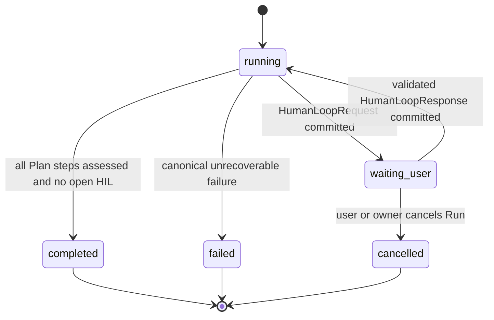
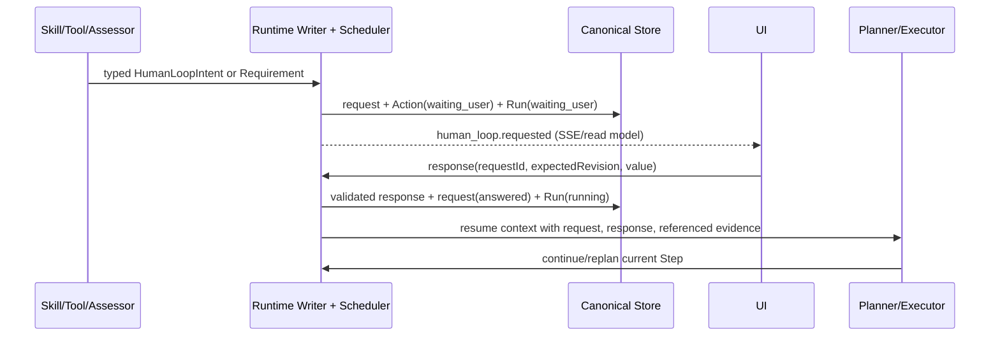

# 通用 Human-in-the-Loop（HIL）设计

版本：v1 设计稿

日期：2026-09-10

状态：待评审

关联：[可恢复 Runtime 设计](./RECOVERABLE-RUNTIME-DESIGN.md)、[总体架构](./ARCHITECTURE.md)、[轻量首轮 Planner 设计](./LIGHTWEIGHT-FIRST-ROUND-PLANNER-DESIGN.md)

## 1. 目标

Human-in-the-Loop 不是搜索场景、危险操作确认或 Recovery 的附属 UI。它是 Runtime 的通用控制能力：任何已授权的 Skill、Tool、Planner 或 Assessor 都可以基于已持久化事实声明“必须由用户作答，才能安全继续”。

本设计建立以下契约：

> 未解决的用户交互请求是 canonical 执行事实和非交付 Goal Gap。Runtime 必须停止推进受其影响的 Step；Terminal Committer 不得完成 Run；用户回答被校验、持久化并作为下一次调度与模型上下文的输入。

它覆盖四个稳定语义，而不是业务名称：

| kind | 用户提供什么 | 示例 |
|---|---|---|
| `selection` | 在已给候选中选择一个或多个 | 多个实体、文档版本、实施方案 |
| `input` | 只能由用户补充的字段或文件 | 地区、截止日期、收件人、缺失附件 |
| `confirmation` | 确认对事实、范围或下一步的理解 | 采用哪一版结果、是否按该范围继续 |
| `approval` | 对有影响范围的动作明确同意或拒绝 | 发送、发布、覆盖、付费调用 |

`approval` 不等于 HIL 的全部；普通澄清、候选选择和信息补全同样进入此链路。

## 2. 当前缺口

当前 `ask_user` 仅属于 `recovery_decisions`：它只能在 `runtime_action.state = recovery_required` 后进入 `run_recovery_states.waiting_user`，并且数据模型只有自由文本 `question` 与 `response`。正常 Plan Step 无法创建同类对象。

这会产生两个错误边界：

1. Skill 的“请用户确认”只是提示词，模型可以不执行；它不是 Runtime 能判定和阻断的事实。
2. Tool 取得了候选或缺失信息后，即使原始结果可回读，Context projection、Step Assessment 和 Terminal 仍可仅凭一个宽泛 `source_summary` 将 Run 完成。

因此，不能通过给某个 Skill 增加一句确认提示修复。必须把用户交互从 Recovery 私有分支提升为正常执行路径上的 canonical object。

## 3. 设计原则与非目标

### 3.1 原则

- **领域归 Skill，控制归 Runtime。** Skill/Tool 决定何时需要选择、字段含义和候选内容；Kernel 只校验通用 schema、暂停、持久化、授权、恢复和完成门禁。
- **结构化请求，不以模型 prose 控制状态。** “请确认”文字、Tool stdout 文本或最终答复都不能单独让 Run 进入或离开等待状态。
- **请求与回答均为不可变事实。** 不能以更新 UI 文案覆盖旧请求或旧回答；更正、撤销和重问创建新 revision/新请求并保留因果引用。
- **`waiting_user` 是可恢复的执行状态，不是 `blocked`。** 它不代表失败，不消耗模型/Tool 重试预算，也不允许 Scheduler 继续受影响的工作。
- **统一而非兼容双轨。** Recovery 需要用户输入时也创建同一 `HumanLoopRequest`；不保留第二套 recovery-only 问答协议作为控制输入。
- **回答是数据，不是指令。** Runtime 按已声明 response schema 校验和引用回答，不能把用户文本作为可执行 Plan、Tool 参数或权限提升命令。

### 3.2 非目标

- 不由 Kernel 根据企业名称、邮件、合同或任意业务词推断是否应询问用户。
- 不承诺用户回答后外部副作用 exactly-once；外部 effect 仍遵循 Tool 的 receipt、幂等与 replay policy。
- 不让 UI 本身决定“已确认”；UI 只是 canonical 请求的投影和回答提交方。
- 不把一次普通会话消息自动当作对所有等待请求的回答。回答必须绑定 request ID。

## 4. Canonical 对象

### 4.1 `agentloop.humanLoopRequest/v1`

每个请求由 RuntimeContextWriter（或本仓现有事务写入边界）作为唯一写者创建。生产上可存为独立对象表并将摘要投影到 Run；不要把完整 JSON 塞进 `runs` 或 UI local state。

```ts
type HumanLoopKind = "selection" | "input" | "confirmation" | "approval";
type HumanLoopOrigin = "skill" | "tool" | "planner" | "assessor" | "recovery";
type HumanLoopStatus = "open" | "answered" | "superseded" | "cancelled" | "expired";

interface HumanLoopRequestV1 {
  schema: "agentloop.humanLoopRequest/v1";
  id: string;
  runId: string;
  planId?: string;
  stepId?: string;
  actionId: string;
  origin: HumanLoopOrigin;
  kind: HumanLoopKind;
  title: string;
  prompt: string;
  rationale: string;
  evidenceRefs: string[];
  responseSchema: HumanLoopResponseSchema;
  resume: {
    mode: "continue_step" | "replan_step" | "recovery_review";
    targetStepId?: string;
  };
  status: HumanLoopStatus;
  revision: number;
  createdAt: number;
  resolvedAt?: number;
  expiresAt?: number;
}
```

`HumanLoopResponseSchema` 是受限的、可渲染的判别联合，而不是任意 JSON Schema 或 HTML：

```ts
type HumanLoopResponseSchema =
  | { type: "select"; minSelections: number; maxSelections: number; options: Array<{
      id: string; label: string; description?: string; evidenceRefs?: string[];
    }> }
  | { type: "form"; fields: Array<{
      id: string; label: string; valueType: "text" | "textarea" | "date" | "number" | "file_ref";
      required: boolean; description?: string; maxLength?: number;
    }> }
  | { type: "confirm"; acceptLabel: string; rejectLabel: string; requireReasonOnReject?: boolean };

interface HumanLoopResponseV1 {
  schema: "agentloop.humanLoopResponse/v1";
  id: string;
  requestId: string;
  runId: string;
  requestRevision: number;
  value: unknown; // 必须已通过 request.responseSchema
  actorUserId: string;
  createdAt: number;
}
```

约束：

- `selection` 使用 `select`；其 option ID 是稳定、不透明的值，显示标签不得作为后续 Tool 的唯一标识。
- `input` 使用 `form`；文件字段只能引用当前用户有权读取且已通过 intake 的 source ID，不能提交主机路径或 URL。
- `confirmation`、`approval` 使用 `confirm`；拒绝不是错误，按请求的 `resume.mode` 回到当前 Step 供 Planner/Skill 处理。
- `evidenceRefs` 必须指向同一 Run 已持久化的 ToolResult、Source、Assessment 或前序 HIL 对象。Runtime 拒绝悬空引用和跨 Run 引用。
- 请求在 `open` 时不可修改其语义字段。候选变化、问题重写或 schema 改变必须先 `superseded` 再创建新请求。

### 4.2 存储与事件

新增：

```text
human_loop_requests(
  id PK, run_id, plan_id NULL, step_id NULL, action_id,
  origin, kind, title, prompt, rationale,
  evidence_refs_json, response_schema_json, resume_json,
  status, revision, created_at, resolved_at NULL, expires_at NULL
)
human_loop_responses(
  id PK, request_id UNIQUE, run_id, request_revision,
  response_json, actor_user_id, created_at
)
```

关键索引：`(run_id, status, created_at)`、`(action_id, status)`；同一 Run 至多一个 `open` 请求，由数据库唯一约束或事务内条件写保证。

同一事务必须写入对象、Run/Action 状态和以下事件：

```text
human_loop.requested
human_loop.answered
human_loop.superseded
human_loop.cancelled
human_loop.expired
```

事件用于 SSE 与审计；对象表才是当前请求、revision 与回答唯一性的权威来源。

## 5. 生产者协议

HIL 请求只能从经过 schema 校验的三类输入创建，三者最终归一为上节对象。

### 5.1 Skill/Planner 主动请求

每个可执行 Step 暴露一个通用受控 Tool `request_human_loop`。Skill 指令可要求模型在满足某个领域条件时调用它；Kernel 不需要知道该条件是“候选企业”“合同版本”还是“缺少收件人”。

```ts
request_human_loop({
  kind, title, prompt, rationale, evidenceRefs,
  responseSchema, resume,
}) -> { requestId, status: "open" }
```

调用成功后，当前模型回合不再物化执行 Tool，也不接受完成候选。Runtime 将当前 `model_turn` 关闭为 `waiting_user`，创建 `human_loop` Action，并把 Run 转为 `waiting_user`。

### 5.2 Tool 事实触发

仅靠 Skill prompt 仍不足以避免模型忽略确认。Tool 可在其结构化结果中返回通用 `humanLoopRequirement`：

```ts
{
  schema: "agentloop.toolResult/v1",
  facts: [...],
  humanLoopRequirement: {
    kind: "selection",
    title: "请选择目标主体",
    prompt: "检索返回多个可区分主体。请选择要查询详情的主体。",
    rationale: "候选之间不能由 Runtime 推断等同关系。",
    evidenceRefs: ["tool-result-ref"],
    responseSchema: { type: "select", minSelections: 1, maxSelections: 1, options: [...] },
    resume: { mode: "continue_step", targetStepId: "..." }
  }
}
```

`ToolExecutionKernel` 在提交 ToolResult 的同一事务中验证并提升该 requirement。若有效，Scheduler 必须先创建 HIL，不把该结果单纯压缩为摘要后交给模型决定是否询问。

这保持通用边界：例如企业查询 Skill 的脚本根据实际候选数生成 `selection` requirement；Kernel 只理解候选选项和暂停语义，不理解企业名称或匹配规则。

### 5.3 Assessment 与 Recovery

- Step Assessor 在发现“当前证据无法满足、且缺失事实只能由用户提供”时，提交结构化 `HumanLoopIntent`，而不是 `failedBoundary.suggestedRepairShape = ask_user`。
- Recovery Evaluator/Planner 在不安全副作用状态未知等情形创建 `origin: recovery` 的同类请求，并将 `resume.mode` 设为 `recovery_review`。
- 旧的 Recovery `ask_user` 是上述 `origin` 的一个 producer，不再拥有独立的 `question/response` 表和 API。

无论 producer 是谁，Runtime 都要验证 action/run/step 归属、evidence references、响应 schema、当前 action revision 与权限；模型本身不能自行设定 `status`、恢复 Run 或提交 Outcome。

## 6. 状态机与模块职责





| 模块 | 负责 | 不负责 |
|---|---|---|
| Skill / Skill-owned Tool | 定义何时需要人、候选/字段语义、把领域结果映射成 typed requirement | 改 Run 状态、相信未校验回答、提交完成 |
| Planner | 基于 HIL 回答继续或重规划当前 Step；可主动提交 typed request | 自行消除 HIL、提交终态 |
| ToolExecutionKernel / Binder | 验证 Tool requirement 与引用；在结果提交事务中创建请求 | 解释业务候选、从 prose 猜测确认 |
| Runtime Scheduler | 将 `open` HIL 转为非交付 Goal Gap，停止相关调度；回答后创建后续 action | 推断用户选择 |
| Context Assembler | 将请求、已校验回答和 evidence refs 投影给恢复后的 Step | 以摘要替换 option IDs 或原始证据 |
| Assessor | 判定证据不足时提出 typed HIL intent；拒绝不满足的候选 | 将 HIL 当作已完成证据 |
| Terminal Committer | 原子拒绝存在 `open` HIL/非交付 gap 的 Delivery | 通过模型文本关闭请求 |
| UI/API | 呈现 schema、提交受限 response、显示影响和等待状态 | 本地判断通过、直接恢复 Scheduler |

### 6.1 调度和完成门禁

1. 创建 `open` request 时，Writer 原子地把关联 Action 标为 `waiting_user`，Run 标为 `waiting_user`，并停止对该 Step 及依赖 Step 的调度。
2. 任何创建新 `model_turn`、Tool 调用、Assessment 或 Delivery 前，Scheduler 先检查 Run 是否有 `open` HIL。存在即拒绝领取，而不是后台继续执行。
3. 回答提交采用 `requestId + requestRevision` CAS；成功后将 request 标为 `answered`，写入 response，解除关联 Action，并把 Run 置回 `running`。
4. `continue_step` 恢复同一已 admitted Plan revision 和 target Step；`replan_step` 创建受现有 Admission 约束的 revision；`recovery_review` 返回 Recovery Evaluator。三者都不得直接跳到 Delivery。
5. Terminal Committer 的数据库查询必须在同一提交事务断言：没有 `human_loop_requests.status='open'`、没有受阻的非交付 Goal Gap、所有 Plan Step 已批准。违反时返回 `HUMAN_LOOP_UNRESOLVED`。

## 7. API、UI 与安全

### 7.1 API

```text
GET  /v1/runs/:runId/human-loop/current
GET  /v1/runs/:runId/human-loop/history
POST /v1/runs/:runId/human-loop/:requestId/respond
       { expectedRevision, value, idempotencyKey }
POST /v1/runs/:runId/human-loop/:requestId/cancel
```

`POST respond` 只在请求 `open`、归属当前用户、revision 匹配且 value 满足 response schema 时成功。重复同一 idempotency key 返回原 response；不同 value 的重复回答返回 `409`。所有读取和写入均复用 Run 所有权谓词，跨租户返回 `404`。

SSE 发送请求摘要和 response 状态变化；选择项描述可能包含敏感字段时，详情仍通过具备 Run 授权的读取端点加载，不能把完整证据放到事件里。

### 7.2 UI

等待卡由 `responseSchema` 渲染，不由 Skill 名称选择组件：

- `select`：单选/多选候选卡，显示标签、描述、证据来源；提交前校验选择数量。
- `form`：字段级必填与长度校验；文件选取只列出当前 Run 可见的 Source。
- `confirm`：明确显示接受/拒绝的影响，拒绝原因字段按 schema 出现。
- 页面状态显示“等待你的输入”，不显示为失败或已完成；Run timeline 中保留请求和回答的审计条目。

UI 刷新、断线重连或多个浏览器标签只读取同一 canonical request。第一个成功的 CAS 回答获胜，其余页面收到已回答投影并禁用表单。

### 7.3 安全与资源边界

- 选项、字段标签和 prompt 按普通不可信文本渲染，禁止 HTML、脚本、客户端 URL 动作和任意组件名。
- `approval` 的同意仅解除该 request 绑定的 action/step，不扩张 Capability Grant；实际 Tool 调用仍逐次鉴权。
- 回答大小、字段数量、选项数、描述长度和总 evidence refs 有硬上限；请求创建受 Run wall-clock 预算和 tenant policy 限制。
- 过期不会自动视为同意。Runtime 将 request 标为 `expired`，由其 `resume` policy 创建新的 HIL、进入受控 Recovery 或失败。

## 8. 迁移与实施批次

这是控制状态收敛，不采用长期双读/双写。

### B1：Canonical contract 和持久化

1. 新增对象、repository、事件、索引与唯一 open-request 约束。
2. 将 Run 生命周期扩展为可见 `waiting_user`，并将 Action 扩展为 `human_loop / waiting_user`；保留 `completed|failed|cancelled` 为唯一终态。
3. 实现 Writer 的 create/respond/supersede/cancel 命令和 CAS/invariant checks。
4. Terminal gate 加入 `HUMAN_LOOP_UNRESOLVED` 断言。

### B2：Runtime 收敛

1. 注册通用 `request_human_loop` Tool；在 Agent Loop 中终止当前可执行回合并调度 HIL Action。
2. 支持 ToolResult 的 `humanLoopRequirement`；保证它在 context compaction 前提升为 canonical request。
3. 将 Assessor 的 `ask_user` 结果替换为 HIL intent；将 Recovery 的 `ask_user` 转换为 `origin: recovery` 请求。
4. 删除 `run_recovery_states.waiting_user`、`recovery_user_responses` 及 `/recovery/respond` 作为控制来源。迁移时把尚未回答的旧 recovery question 一次性导入 `origin: recovery` request；历史回答只保留审计，不与新表双读。

### B3：Host 集成和 Skill 采用

1. 参考应用和 Multi Runtime Host 接入 HIL API、SSE 卡片与断线恢复。
2. 为所有需要交互的官方/自定义 Skill 增加 typed producer：可由脚本直接返回 requirement，或由 Skill 工作流调用 generic tool。
3. 对企业信息 Skill：搜索结果多于一个可辨候选时，脚本生成 `selection` requirement；用户选择后才允许 detail Tool。候选只有一个且 Skill 的匹配规则已将其判为明确全称时，才可不请求选择。

### B4：生产验证

1. PostgreSQL 下验证唯一 open request、revision CAS 和跨 worker 恢复；SQLite 仅验证单节点语义。
2. 将 HIL 计入 Run 可观测性与租户配额，并做负载/断线/重复提交演练。

## 9. 验收矩阵

| 场景 | 必须证明 |
|---|---|
| 通用 selection Skill | Tool 返回多个选项后，Run 进入 `waiting_user`；没有模型回合或 Terminal 可越过它；选择后同一 Step 继续 |
| 通用 input Skill | 缺字段创建 `form`；非法字段、超长值、跨 Run 文件引用均被拒绝；合格回答进入恢复上下文 |
| confirmation / approval | 接受和拒绝均持久化；拒绝不会误执行关联 effect；接受后 Tool 仍通过正常 Grant 校验 |
| 企业信息回归 | 实际多候选结果显示候选字段及 evidence；未选择前不调用 detail、不开完成；选择主体后仅对该稳定 option ID 查询详情 |
| Tool-result preservation | ToolResult 被压缩后仍已存在 canonical HIL request；不能因为摘要只保留计数而丢失 choice requirement |
| Terminal negative test | 构造已通过 Assessment 的所有 Step 但存在 `open` request，Terminal 必须返回 `HUMAN_LOOP_UNRESOLVED` 且无 Outcome |
| 并发回答 | 两个标签同时回答，恰好一个 response 被接受；事件顺序、request revision 和最终恢复 action 一致 |
| 重启/租约恢复 | Worker 在 `waiting_user` 时重启，重新加载同一 request；回答后仅一个 worker 继续 |
| Recovery 收敛 | 不安全副作用未知时创建 `origin: recovery` HIL；不再写 recovery-only user response 表 |
| 授权与审计 | 跨用户读取/回答为 404；每个请求、回答、取消和恢复均有 actor、时间、evidence refs 和 action ID |

验收以真实 Host UI + 持久化 Run/Plan/Action/HIL 事实为准。仅出现确认文案、Tool 成功或页面显示候选均不足以证明 HIL 已生效。

## 10. 观测指标

```text
human_loop_requests_total{origin,kind,status}
human_loop_wait_seconds{origin,kind}
human_loop_responses_total{kind,outcome}
human_loop_response_conflicts_total
human_loop_terminal_gate_rejections_total
human_loop_expired_total{origin,kind}
human_loop_open_per_run
```

告警关注：长期开放请求、持续出现同一 Step 的 supersede/re-request、Terminal gate 拒绝异常升高、回答 schema 校验失败率，以及请求创建后仍发生 Tool effect 的协议违例。

## 11. 明确决策

1. HIL 是正常执行能力，非 Recovery 专属能力。
2. Skill 可以拥有领域上的“何时问、问什么”；Kernel 不拥有任何领域关键词或分支。
3. HIL 必须有 typed request/response、持久状态、CAS、调度门禁和 Terminal gate；提示词不是控制协议。
4. `waiting_user` 可恢复且非终态；不用 `blocked` 表达普通信息缺失或待确认。
5. Recovery 复用同一 HIL object 和 API，避免第二套问答状态机。
