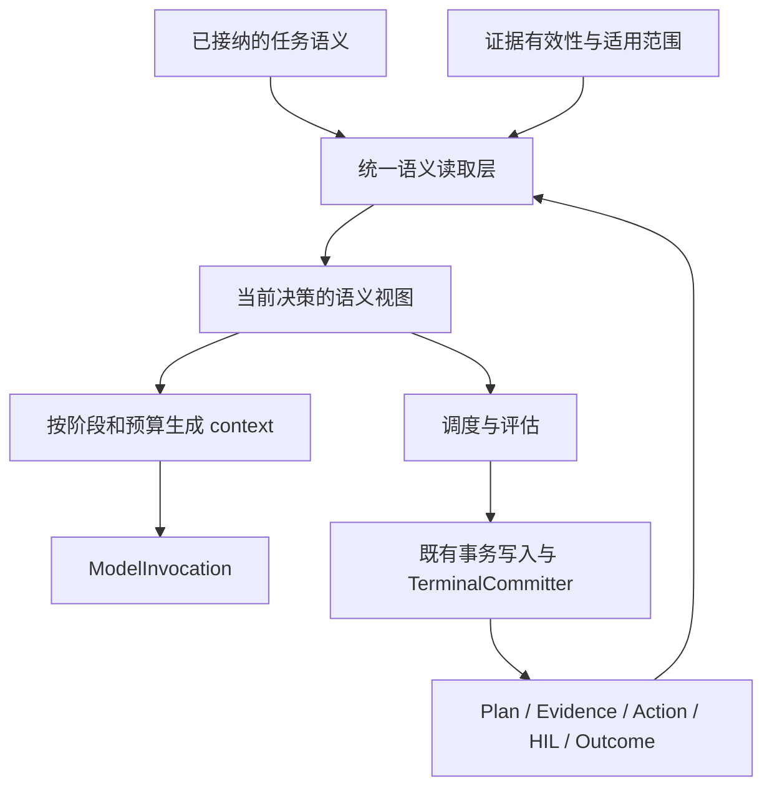

# AgentLoop 全链路语义标准化与上下文统一改造方案

版本：v1.0
日期：2026-09-15
状态：设计方案，尚未实施
范围：AgentLoop Kernel、Multi Runtime Host 及相关状态投影

## 1. 目标与总体判断

本方案的目标是：让同一份任务要求和证据，在规划、执行、评估、跨轮复用、上下文裁剪和中断恢复中保持一致，并能够追溯每次决策使用的事实与版本。

AgentLoop 已有 Plan、Admission、StepExecutionBinding、Evidence、RuntimeAction、Assessment、HIL 和 TerminalCommitter 等基础。主要缺口在于不同消费者仍分别推导任务语义和证据状态，部分 context 投影甚至会因为展示窗口变化而改变证据满足状态。

实施路线为：

> 统一事实与语义决定 → 统一语义读取 → 按阶段生成 context → 闭合评估与恢复 → 激活事实驱动的调度。

沿用现有权威对象和终态提交链路。共享语义视图是读取结果，不是一套可以独立修改的 Runtime 状态机。

本次授权仅为编写方案文档。文档中的接口调整、存储调整、测试和运行验证均为后续实施事项。

## 2. 评估依据与边界

评估针对 2026-09-15 当前工作区，包括当时已有的未提交改动，不等同于某个已发布版本。依据包括源码阅读、已有本地事件只读查询、相关测试和不调用外部模型的内存验证。

### 2.1 已确认的问题

| 编号 | 问题 | 证据与影响 |
|---|---|---|
| F1 | 证据满足状态依赖展示窗口 | `summarizeStepEvidence()` 先保留最后 12 条工具结果，再计算满足状态。13 条结果的内存验证中，首条有效 `source_summary` 被排除，下游将其标记为缺失 |
| F2 | Evidence 类别在消费者之间不一致 | `table_coverage`、`derived_aggregation` 被 Assessor 识别，但未进入 StepSemanticFrame 的 Runtime 核心证据集合；最小验证得到空 `completionBoundary` |
| F3 | 规则与模型评估的证据集合不同 | `evidence` 合并依赖证据，`modelEvidence` 使用当前候选投影，没有进行同样合并 |
| F4 | 长候选文本缺少评估时的按需读取 | 超过 2,000 字符的候选被投影为前 1,000 字符、有限提纲和哈希；模型评估器仅有 `submit_assessment`，普通正文末尾的事实可从其输入中消失 |
| F5 | 不同 Step 的 context ID 可能相同 | ID 由 Run、phase 和 Assembler 局部计数组成；同一 Run 两个 Step 的首次快照在内存验证中具有相同 ID、不同内容 |
| F6 | 恢复没有完整传递原有语义上下文 | `resumeRecovery()` 未向执行器传入正常路径使用的 `turnResolution` 和 `conversationWorkingSet`；Plan revision 后继续执行也存在相同输入缺口 |
| F7 | 工具操作状态尚未贯穿 UI | `tool.completed` 携带 `operationStatus: failed` 和非零退出码时，执行详情投影仍将工具和命令标为 `completed` |

上述验证证明局部边界不一致，不直接证明某个历史 Run 因此交付错误，也未证明 snapshot ID 重复已造成缓存覆盖。

### 2.2 架构缺口

- 执行与评估阶段仍根据 Step objective、successCriteria、工具和 Skill 名称重新分类任务意图。
- 正式跨轮证据复用按目标 Run 限定，执行模型的复用上下文则包含整个 WorkingSet。
- 已记录的 `disputed`、`superseded` 关系没有贯穿执行复用投影及来源适用性判断。
- `requiredFacts`、`satisfiedBy` 和 refinement 状态已经可以表达、持久化，但当前 DependencyScheduler 尚未形成基于事实满足状态的完整推进闭环。
- RuntimeContextSnapshot 主要是模型投影容器，尚未完整关联任务语义版本、Plan revision、证据集合和事件水位。

### 2.3 验证基线

前序评估运行了 context assembler、execution context policy、recovery transcript、planning runtime、models 五组相关测试：288 项，279 通过、9 失败。失败包括 6 项证据能力声明不匹配、2 项语义断言差异和 1 项 Skill 路径缺失，尚未逐项完成根因归类。

一次本地最近 50 个 Run 的读取样本中，360 条 `context.assembled` 事件的估算输入 token 为 P50 21,513、P95 76,193、最大 93,190；当时该数据库没有 `context.compacted` 事件。这是既有运行记录的观察值，不是当前源码部署后的性能基准，也不能证明压缩恢复闭环已通过真实运行验证。

## 3. 必须成立的语义不变量

| 不变量 | 验收含义 |
|---|---|
| 语义决定具有明确来源 | 用户要求与 Planner 补充可区分；已接纳的要求只能经明确修订改变 |
| 投影不改变事实状态 | 裁剪、摘要、分页只能减少展示细节，不能改变证据满足状态 |
| 消费者共享证据身份与适用规则 | 执行、规则评估、模型评估对同一证据的来源、范围和有效性使用相同规则 |
| 恢复保持任务语义 | 除明确接纳的新输入外，目标、约束、证据绑定在恢复前后保持一致 |
| 决策上下文可追溯 | 每次模型调用都能定位任务语义版本、Plan 版本、证据集合及投影版本 |
| 观察事实不自动升级为内容正确性 | Tool receipt 仅证明其实际观察的效果；获取来源或生成文件不自动证明结论正确 |

共享证据不要求规则评估器和模型评估器总是给出相同结论。它要求能够解释各自基于哪些事实、检查了哪些要求以及判断范围。

## 4. 目标职责与数据流



| 边界 | 所有权 |
|---|---|
| 任务解析与 Admission | 确定并接纳任务要求，将要求分配到 Step |
| Tool 结果归一化 | 保留原始结果，提取带来源的观察事实和操作状态 |
| 证据解析与归约 | 判断哪些证据适用于当前要求，以及满足、失效、冲突或 caveat 状态 |
| 语义读取层 | 在指定版本和范围上构造一致的决策视图 |
| Context 投影 | 控制展示、预算、摘要和按需读取，不重新决定任务要求或证据状态 |
| Assessment | 对指定要求作判断，记录依据与实际检查范围 |
| TerminalCommitter | 检查当前有效版本的完成条件并提交最终结果 |

Run grant 保持工具授权边界。当前 StepExecutionBinding 表达计划所需能力和偏好的执行工具，不作为 Step 工具白名单；资源和 Skill 继续按照当前规则限定。文档、Admission、执行提示和诊断信息应统一采用这一含义。

## 5. 第一阶段：统一 Evidence 与工具结果语义

### 5.1 统一定义与归约

以现有 `EvidenceKind` 为基础集中维护类别及语义属性，StepSemanticFrame、进度策略、Assessor、交接投影共同消费。类别的用途差异通过明确属性表达，避免各模块手写互不一致的集合。

集中原始结果到证据记录的归一化，以及证据记录到当前要求满足状态的归约。状态计算必须使用完整的适用证据集合：

```text
完整的适用证据引用
  → 计算满足状态
  → 选择展示明细
  → 生成有预算的模型投影
```

`summarizeStepEvidence()` 的最后 12 条限制只能作用于展示明细。状态、覆盖范围、缺口和决定性证据引用不能从裁剪后的窗口重新计算。

归约规则需区分操作失败与部分证据仍然有效的情况，保留冲突和 caveat，不通过丢弃异常记录制造满足状态。

### 5.2 工具结果归一化边界

工具结果进入 Runtime 时，统一提取调用状态、操作状态、证据引用和原始结果引用。Tool/provider 的结果适配发生在这一边界；恢复、进度、评估和 UI 不再独立猜测结果语义。

- `invocationStatus: completed` 可以与 `operationStatus: failed` 同时存在。
- 未知操作状态应显式保留。
- 退出码是命令结果的一种信号，不能代替所有工具的结果契约。
- 原始结果仍保存，以便审计和后续精确读取。

### 5.3 修改范围与验收

主要模块：`planning/contracts.ts`、`runtime/tool-result-evidence.ts`、`runtime/tool-operation-outcome.ts`、`runtime/step-semantic-frame.ts`、`runtime/tool-progress-policy.ts`、`runtime/execution-context-policy.ts`、`planning/assessor.ts`，以及 Multi Runtime 执行详情投影。

验收：

- 展示 3 条、12 条或全部明细，证据满足状态相同。
- 在关键 receipt 后追加任意数量的无关工具调用，不会使原有满足状态消失。
- `table_coverage` 和 `derived_aggregation` 在各消费者中被一致识别。
- 非零退出、调用失败、调用拒绝、操作状态未知在执行、恢复和 UI 中语义一致。

## 6. 第二阶段：任务语义一次接纳、逐层消费

扩展现有 ConversationTurnResolution 与 Admission 结果，明确以下内容：

| 内容 | 用途 |
|---|---|
| 目标、用户约束及来源 | 区分原始用户要求与 Planner 补充 |
| 交付形式和证据要求 | 避免执行、评估重新分类 |
| 跨轮关系与目标引用 | 明确继续、修改、纠正的对象 |
| 语义版本与变更原因 | 支持恢复和审计 |

Admission 将要求分配到 Step 后，执行与评估直接消费接纳结果。`classifyTaskIntent` 等识别逻辑保留在入口解析和明确的语义修订阶段；执行策略可以选择方法，但不能通过重新读取 Step 措辞修改任务要求。

需要区分两种变化：

- 方法变化：选择其他工具、来源或执行路径，不必改变用户要求。
- 要求变化：改变目标、来源严格程度、交付形式等，必须经过明确的修订并记录原因。

普通对话与弱证据要求继续保持轻量。统一模型不意味着为所有任务新增来源、文件或 Skill QA 门槛。

主要模块：`planning/contracts.ts`、`planning/planner.ts`、`planning/admission.ts`、`runtime/task-intent.ts`、`runtime/run-service.ts`、`planning/assessor.ts`。

验收：改写 Step objective 不改变证据要求；“继续”保留原约束；用户明确修改要求时产生可追溯的新版本；执行和评估的规范性要求来自同一个接纳结果。

## 7. 第三阶段：统一语义读取与 context 组装

### 7.1 共享决策视图

正常执行、评估、跨轮继续和恢复都先调用共享语义读取入口，获得：

- 当前有效任务语义和 Plan 版本。
- 当前要求及满足状态。
- 已绑定的证据引用。
- 可供选择的历史候选材料。
- 未解决问题、冲突与 caveat。
- 当前资源和授权范围。

读取层组合既有权威对象，不另行持久化一份可独立修改的完整任务状态。需要缓存时，缓存身份应绑定来源版本和读取策略版本。

### 7.2 历史候选与有效证据分离

模型可见的历史材料需要区分“候选参考”与“当前要求的有效依据”。候选材料只有经过相同的适用性解析，才能进入满足状态计算。

跨轮复用统一处理：

- 根据目标及其证据来源链确定适用范围，支持必要的间接来源引用。
- 将 `disputed`、`superseded` 纳入有效性判断与模型投影。
- 纠正一个结论时，定位受影响的事实或产物；不自动否定整个旧 Run 的所有观察事实。
- WorkingSet 作为有界展示窗口，超出窗口的相关证据仍可通过稳定引用定位。
- 内容变化、覆盖不足或时效要求不能仅依赖提示词判断，应作为读取结果中的明确状态或待解决事项。

### 7.3 阶段投影

Planner、Execution、Assessment、Recovery 各有不同的信息密度和预算，但都从共享语义视图派生。ContextAssembler 负责展示策略、压缩和 token 预算，不计算另一套权威证据状态。

主要模块：`runtime/run-service.ts` 中 WorkingSet 与复用逻辑、`runtime/execution-context-policy.ts`、`runtime/context-assembler.ts`、Planner 和 Assessor 的 context 构造入口。

验收：各阶段对同一证据的身份、有效性和满足状态一致；失效材料可作为历史展示，但不能自动满足当前要求；超过 WorkingSet 窗口的指定证据仍可定位。

## 8. 第四阶段：补齐 Assessment 的证据可见性

将 `evidence` 与 `modelEvidence` 调整为同一证据集合的完整表示与模型投影，消除依赖证据的合并差异。其关系应可通过引用集合和来源版本验证。

模型评估采用两步读取：

1. 默认提供当前要求、证据状态、摘要与稳定引用。
2. 判断所需内容被省略时，允许按需读取当前评估绑定的候选文本、工具结果或产物版本。

读取能力限定为当前证据范围，支持段落或范围查询，记录实际读取范围，并设置调用和 token 预算。Assessor 不获得执行任务、修改文件或任意联网的能力。

评估结果应能区分满足、不满足和当前材料不足以判断，并记录判断范围。预算不足或无法读取时，返回具体信息缺口，不将摘要和哈希当作全文已检查的证明。

Assessment 绑定当前 Step 契约和证据版本。TerminalCommitter 提交时确认评估仍适用于当前结果，保留现有明确 caveat 的交付语义。

主要模块：`planning/contracts.ts`、`runtime/run-service.ts` 的候选评估入口、`planning/assessor.ts`、评估记录存储及 `runtime/terminal-committer.ts`。

验收：

- 长正文末尾的决定性内容可以按需取得。
- 上游提供的必要证据不会在模型评估输入中消失。
- 旧候选的评估不能提交已改变的新候选。
- 仅检查可观察效果的规则评估，不被表示为已验证领域内容正确。

## 9. 第五阶段：统一快照、checkpoint 与恢复

### 9.1 快照身份

每份快照具有唯一 ID，并关联 Run、Plan revision、Step、Action、任务语义版本、证据引用集合、投影策略版本及内容摘要。`supersedesId` 只在明确的决策链中使用。

唯一身份与内容哈希各有用途：前者定位一次快照，后者检验内容一致性。不能仅用 Assembler 实例内计数承担全 Run 身份。

### 9.2 可重建的 checkpoint

checkpoint 表示已提交的决策边界，至少关联：

- 已接纳的任务语义。
- Plan 版本与当前执行位置。
- 证据集合及已处理事件水位。
- 已完成交互与未完成工具调用。
- HIL 请求及回答状态。
- 摘要、保留尾部位置与相关版本。
- 已使用的 Skill 版本引用。

摘要是模型输入优化，不能替代权威证据。恢复时按来源重建事实状态，再恢复投影所需摘要与尾部。

checkpoint 写入遵守现有 Action lease/fence 所有权。失去执行权的旧实例不能写入新的恢复基线。事实提交与 checkpoint 边界需确保一致；中断发生在两者之间时，应能从最后已提交水位确定性重放。

### 9.3 统一恢复入口

正常执行、`resumeRecovery()`、Plan revision 后继续执行统一经过语义读取和 context 构造路径，避免分别拼装输入。

恢复中的新用户回答是明确的新输入，应留下应用记录。不能用恢复时的完整会话或最新 Skill 内容，静默替换中断时的语义基线。

历史数据采用明确的处理策略：可以从持久化事实确定性重建的，重建并记录来源；缺少必要语义或版本时，进入有具体原因的恢复决策。历史终态不因新实现而被追溯改写。

主要模块：`runtime/contracts.ts`、`runtime/context-assembler.ts`、`runtime/recovery-transcript.ts`、`runtime/recovery-planning.ts`、`runtime/run-service.ts`、`runtime/runtime-action-repository.ts` 和相关存储。

验收：同一持久化基线下，连续执行与中断恢复的任务要求、证据绑定和满足状态相同；不同 Step 的快照 ID 不冲突；新增 HIL 回答和 Plan revision 的影响可逐项解释。

## 10. 第六阶段：让 requiredFacts 参与实际推进

在共享证据读取稳定后，明确现有 requiredFacts 的作用范围：当前动作必需的前置事实、执行中可继续探索的事实、最终交付必须满足的事实。

事实满足状态从共享证据解析层派生。调度器根据要求的作用范围决定执行、请求 Plan refinement、请求用户信息或停止，而不是发现任何事实缺口都阻塞。

沿用现有 Plan revision、HIL 和失败边界机制承接调度结果，不另建与其并行的控制状态机。`satisfiedBy` 应解析为可验证的证据引用，而不是仅验证字符串格式。

来源允许替换，执行路径允许探索。Plan revision 可以调整获取方式，但保留要求与证据的绑定历史。

主要模块：`planning/contracts.ts`、`planning/admission.ts`、`planning/scheduler.ts`、`planning/plan-repository.ts` 和 `runtime/run-service.ts`。

验收：必需前置事实缺失时不执行依赖动作；探索性缺口允许推进；来源替换不要求重建固定步骤链；事实满足后能实际触发后续执行或 refinement。

## 11. 实施批次与进入条件

| 批次 | 交付 | 进入下一批的条件 |
|---|---|---|
| 1 | Evidence 定义、归约与工具状态统一 | F1、F2、F7 的回归通过，状态不再依赖展示窗口 |
| 2 | 任务语义贯穿下游 | 执行、评估消费同一接纳结果；措辞变化不改变要求 |
| 3 | 统一语义读取与跨轮有效性 | 消费者证据范围和状态一致，候选材料不会自动升级为依据 |
| 4 | Assessment 按需读取与版本绑定 | F3、F4 的回归通过，评估依据和实际检查范围可追溯 |
| 5 | 快照、checkpoint 与恢复闭环 | F5、F6 的回归通过，正常路径与恢复路径语义等价 |
| 6 | requiredFacts 调度语义 | 必需事实、探索缺口、来源替换与 refinement 形成闭环 |

每批应同时替换其范围内的旧派生逻辑，避免长期保留两个可独立决定同一状态的读取或计算入口。

开始实施前先归类既有 9 项失败：明确当前预期契约，分别处理失效 fixture、缺失依赖与真实回归。不能通过简单调整断言掩盖语义差异。

当前工作区已有的其他改动需要保留，实施提交按批次限定范围。涉及存储变更时，先在数据库副本上验证迁移与重放，再验证新 Run；旧事件只作为历史事实，不作为新代码已经生效的证明。

## 12. 回归与运行验收矩阵

| 场景 | 核心断言 |
|---|---|
| 关键 receipt 后追加大量无关调用 | 满足状态不因窗口变化丢失 |
| 多 Step 共用上游证据 | 执行和评估取得相同的适用证据引用 |
| 长正文末尾有决定性内容 | 模型评估可读取所需原文并留下范围记录 |
| 用户说“继续” | 原目标、用户约束与证据要求保留 |
| 用户纠正或替代历史结论 | 受影响事实的有效性一致传播，未受影响事实仍可使用 |
| 引用超出 WorkingSet 的历史材料 | 可通过稳定引用定位，不靠扩大常驻历史窗口 |
| 同一 Run 多 Step 创建快照 | ID 唯一，版本与来源可追溯 |
| Tool 返回后、评估前中断 | 已提交效果和证据保留，不因恢复盲目重执行副作用 |
| HIL 回答后恢复 | 回答作为明确新输入，旧约束不会被意外替换 |
| Plan revision 后继续 | 新要求、保留证据及退休步骤的影响可解释 |
| 非零退出与未知操作状态 | 执行、恢复、评估和 UI 不混淆调用完成与操作成功 |
| 普通对话和弱证据任务 | 不新增不必要的工具、来源、文件或 QA 要求 |
| 允许 caveat 的任务 | 保留合法 caveated completion，不泛化为强制失败 |
| 必需事实缺失与探索性缺口 | 前者约束相关动作，后者允许探索或 refinement |

源码回归通过后，使用隔离 Host 跑代表性新 Run，核对：

```text
Run → Plan / revision → tool evidence → Assessment
    → TerminalCommitter → Outcome
```

对恢复场景比较语义版本、要求集合、证据引用和满足状态，不要求模型自然语言输出逐字一致。

## 13. 成本与可观测性

建立同一任务集的改造前后基线，观察模型调用数、输入 token、上下文组装耗时、证据读取次数、重复采集次数、评估重试和恢复重放次数。

新增或扩展观测信息应能回答：

- 本次决策使用哪个任务语义和 Plan 版本？
- 哪些证据被绑定，哪些仅作为候选，哪些因何失效？
- 哪些内容被省略，是否存在可读取引用？
- Assessment 实际检查了哪些范围？
- 恢复应用了哪些新事实，保留了哪些旧绑定？

控制成本的主要方式是引用复用、按要求选择证据、按需读取和有版本的派生缓存。不能通过删除完成所需证据降低 token，也不应把全部原文永久放入每个阶段的 context。

## 14. 完成标准与实施约束

方案完成需要同时满足：

1. 已复现的七项问题均有对应回归证据。
2. 语义不变量在普通执行、跨 Step、跨轮和恢复路径中成立。
3. 新 Run 的完成由当前有效契约、证据、Assessment 和 TerminalCommitter 支持。
4. 普通任务的调用成本与执行灵活性没有被无谓增加；必要的成本变化有基线和原因。
5. 代码与文档对已实现能力、投影能力和尚未实现能力的描述一致。

实施时保持以下边界：

- 不靠新增业务、Skill、Provider 或具体 Run 特例消除语义差异。
- 不通过放宽 Assessment、隐藏冲突或扩大摘要窗口代替根本修复。
- 不把事实要求变成固定生产者和固定步骤的流水线。
- 不把 Tool 成功、产物存在、摘要、UI 状态或模型声明当作完整完成证明。
- 不将本文的设计状态标记为已实现，直到相关批次及运行验收完成。
