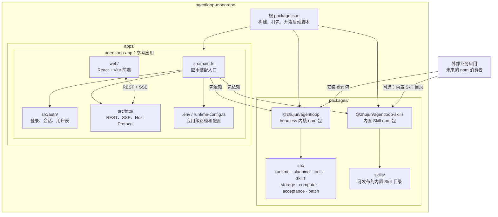
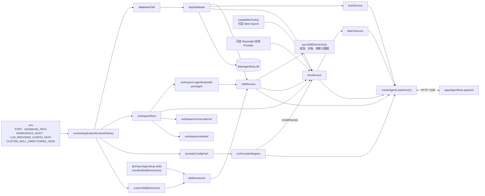
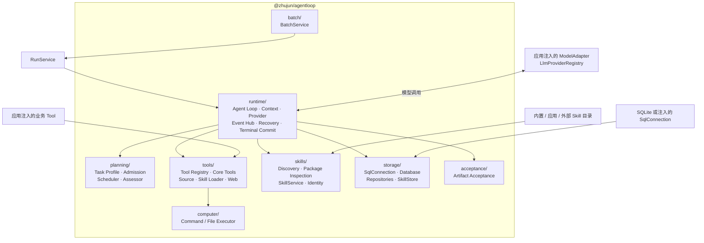
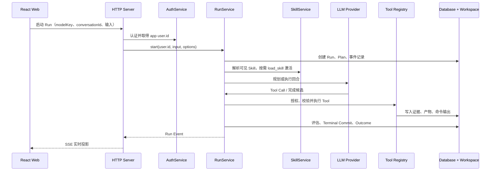

# AgentLoop 应用层次结构图

本文描述当前 monorepo 的代码归属、包依赖和参考应用的运行时装配。它以实际入口与 `package.json` 依赖为准。

## 1. 代码归属与包边界

### 边界结论

| 层 | 负责内容 | 不负责内容 |
|---|---|---|
| `@zhujun/agentloop` | Agent Loop、计划、工具授权与执行、Skill 服务、运行态存储、产物与评估 | HTTP、登录、业务用户表、前端、环境变量解析 |
| `@zhujun/agentloop-skills` | 随 npm 包发布的标准 Skill 目录和 `bundledSkillDirectories()` | Runtime、Tool、Skill 持久化、应用配置 |
| `apps/agentloop-app` | 参考装配、认证、HTTP API、React 前端、应用扩展 Skill 配置 | 不能作为其他应用的内核依赖 |
| 外部业务应用 | 自己的身份、权限、业务 Tool、配置和 UI；通过 npm 包装配内核 | 不应导入参考应用源码或 `packages/agentloop/src` |

## 2. 参考应用启动与依赖注入

`apps/agentloop-app/src/main.ts` 是唯一应用装配入口。它先解析应用配置，再创建内核实例，最后注入 HTTP Server。

## 3. 内核内部关系

`RunService` 组织一次 Run，但具体职责由内核的独立模块承担。应用只在构造时注入数据库、Skill 服务、模型工厂、工作区和扩展 Tool。

## 4. 运行时数据流

## 5. Skill 目录的优先级和落点

参考应用将两个来源合并为一个 `skillDirectories` 列表，并在启动时统一同步：

1. `@zhujun/agentloop-skills` 的发布目录：随 Skills 包发布的通用 Skill。
2. `CUSTOM_SKILL_DIRECTORIES_JSON`：应用或部署环境额外指定的 Skill 目录。

发现的目录包仍保留在其原始目录；用户显式安装的包才会写入由 `WORKSPACE_ROOT` 派生的 `.agentloop/skill-packages/`。跨目录同名 Skill 会失败，不按目录顺序静默覆盖。

## 6. 常用入口

| 目的 | 入口 |
|---|---|
| 内核公共 API | `packages/agentloop/src/index.ts` → `@zhujun/agentloop` |
| 内置 Skill 目录 | `packages/agentloop-skills/src/index.ts` → `bundledSkillDirectories()` |
| 参考应用装配 | `apps/agentloop-app/src/main.ts` |
| 应用路径配置 | `apps/agentloop-app/src/runtime-config.ts` |
| HTTP 与 SSE API | `apps/agentloop-app/src/http/server.ts` |
| Web 前端 | `apps/agentloop-app/web/src/` |
| 根构建、打包、启动命令 | `package.json` |
